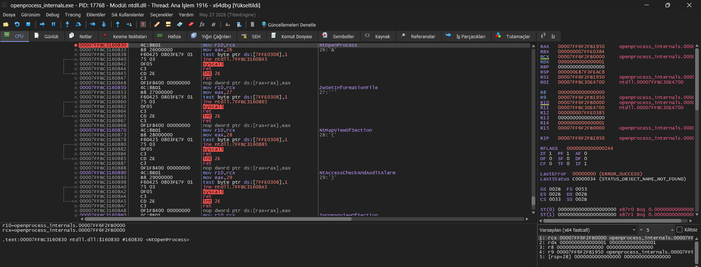

# Windows Process Internals Lab

> Hands-on Windows internals study focused on process handles, access
> masks, virtual memory inspection, handle inheritance, and the Win32 →
> Native API → syscall path.
>
> **Purpose:** understand Windows process manipulation from a defensive
> / detection-engineering perspective by observing API behavior directly
> in C and x64dbg.

------------------------------------------------------------------------

## 1. Objective

The goal of this lab series was not to build an injection framework or
exploit anything.

The goal was to answer a simpler but more important question:

> **"When Windows code interacts with another process, what actually
> happens underneath the Win32 API?"**

The study followed this model:

``` text
Win32 API
    ↓
kernel32 / kernelbase
    ↓
ntdll Native API
    ↓
syscall
    ↓
Windows kernel
    ↓
Process / Handle / Memory objects
```

Each concept was tested with a small C program and, where useful,
inspected with x64dbg.

------------------------------------------------------------------------

# 2. Lab 1 --- Access Masks

## What was tested

This lab focused on Windows process access rights and how individual
rights can be combined into access masks.

## C File

[Access Masks](../scripts/test4.c)

Example output:

``` text
PROCESS_QUERY_INFORMATION:       0x0400
PROCESS_VM_READ:                 0x0010
PROCESS_VM_WRITE:                0x0020
PROCESS_VM_OPERATION:            0x0008
PROCESS_CREATE_THREAD:           0x0002
PROCESS_QUERY_LIMITED_INFORMATION: 0x1000

PROCESS_VM_READ | PROCESS_VM_WRITE:
0x0030

PROCESS_VM_READ | PROCESS_VM_WRITE | PROCESS_VM_OPERATION:
0x0038
```


## What was learned

Windows process access is represented as a **bit mask**.

Individual rights can be combined with bitwise OR:

``` c
PROCESS_VM_READ |
PROCESS_VM_WRITE |
PROCESS_VM_OPERATION
```

producing:

``` text
0x0038
```

This matters because APIs such as `OpenProcess()` do not simply say:

> "Give me the process."

They request a specific set of **permissions on the resulting handle**.

For example:

``` text
PROCESS_VM_READ
```

is different from:

``` text
PROCESS_VM_READ |
PROCESS_VM_WRITE |
PROCESS_VM_OPERATION
```

This becomes particularly important when interpreting telemetry such as
Sysmon Event ID 10 and its `GrantedAccess` field.

------------------------------------------------------------------------

# 3. Lab 2 --- OpenProcess and the Process Handle

## Test

A small C program was written around:

```c
HANDLE hProcess = OpenProcess(
    PROCESS_QUERY_LIMITED_INFORMATION,
    FALSE,
    targetPid
);
```

The program asks for a target process ID and attempts to open that
process with PROCESS_QUERY_LIMITED_INFORMATION.

If successful, it prints:

```c
Target PID
Process Handle
Process ID resolved from Handle
```

The handle is then closed with:
```
CloseHandle(hProcess);
```

## C File
[OpenProcess](../scripts/test3.c)

Example Output:

```
Windows Internals Lab-3: Remote Process Handle
===============================
Enter the target process ID: 5800
[+] Target PID     : 5800
[+] Process Handle : 00000000000000CC
[+] Process Handle Value: 5800
[+] bInheritHandle      : FALSE
Process handle closed successfully.
```

## Important observation

The returned value was something similar to:

```
00000000000000CC
```

This is a HANDLE value.

It is not the target PID and it is not the address of the process object
in kernel memory.

The target PID in this test was:

```
5800
```

while the returned handle was:

```
00000000000000CC
```

These are two completely different values.

Conceptually:

```
Our process
    |
    | HANDLE value
    v
Handle table
    |
    v
Process object
```

The handle provides the calling process with access to the
kernel-managed process object according to the access rights requested
when the handle was created.

## What was learned

OpenProcess() does not return a PID.

It returns a HANDLE representing an entry through which the calling
process can access the target process object.

The basic flow is:

```
Target PID
    |
    | OpenProcess()
    v
Process HANDLE
    |
    | GetProcessId()
    v
Target PID
    |
    | CloseHandle()
    v
HANDLE closed
```

This establishes the basic relationship between:

```
PID
HANDLE
Process Object
```

which is fundamental to understanding later process manipulation APIs.

------------------------------------------------------------------------

# 4. Lab 3 --- `bInheritHandle` and Handle Inheritance

## What was tested

The `bInheritHandle` parameter of `OpenProcess()` was investigated
together with the parent/child process handle inheritance mechanism.

The parent process first opens the target process:

```c
HANDLE hProcess = OpenProcess(
    PROCESS_QUERY_LIMITED_INFORMATION,
    FALSE,
    targetPid
);
```
The resulting process handle is then used in a parent/child process
experiment.

## Parent process

The parent creates a child process with CreateProcessA().

The child receives the handle value and attempts to use it with:

```
GetProcessId(hInherited);
```

## Child process

The child converts the received handle value back into a HANDLE and
tests whether the handle is valid.

If successful:

```
[CHILD] BASARILI!
Miras alinan Handle uzerinden okunan PID: 5800
```

If the handle is not valid:

```
[CHILD] BAŞARISIZ!
Handle gecersiz. Hata Kodu: 6
```

## Initial observation

Simply changing the bInheritHandle value of OpenProcess() does not
immediately make the handle appear in another process.

The effect of handle inheritance becomes relevant when a child process
is created.

Conceptually:

```
Parent Process
     |
     | Process Handle
     |
     | CreateProcess()
     v
Child Process
     |
     | inherited handle
     v
Target Process
```

The experiment demonstrated that handle inheritance is a
parent/child process relationship, rather than a property that
causes an existing handle to automatically appear in every process.

## C Files

[Parent](../scripts/parent.c)

[Child](../scripts/child.c)

------------------------------------------------------------------------

# 5. Lab 4 --- Actual Handle Inheritance

To demonstrate the effect of bInheritHandle, a parent/child process
test was created.

The parent process:

* 1- Opened the target process.
* 2- Requested an inheritable handle.
* 3- Created a child process.
* 4- The child attempted to use the inherited handle.

```
bInheritHandle = TRUE
```

Observed:

```
[PARENT] Allocated Handle: 0000000000000060
[PARENT] Child process triggered...


    [CHILD] Child process started!
    [CHILD] Handle inherited from parent: 0000000000000060
    [CHILD] SUCCESS! PID read through inherited handle: 5800
```


The child successfully used the inherited handle.

```
bInheritHandle = FALSE
```

Observed:

```
[PARENT] Allocated Handle: 0000000000000060
[PARENT] Child process triggered...


    [CHILD] Child process started!
    [CHILD] FAILED! Handle invalid. Error Code: 6
```


6 corresponds to:

```
ERROR_INVALID_HANDLE
```

## Conclusion

The difference between TRUE and FALSE is therefore not:

* "OpenProcess behaves differently."

The important difference is:

 * Whether the resulting handle can participate in handle inheritance
   when a suitable child process is created.


Conceptually:

```
bInheritHandle = TRUE

Parent
  |
  | Handle
  v
Child
  |
  | same inherited handle
  v
Target Process
```

versus:

```
bInheritHandle = FALSE

Parent
  |
  | Handle
  v
Target Process

Child
  |
  X
No inherited handle
```

------------------------------------------------------------------------


# 6. Lab 5 --- NtOpenProcess

## C File 

[NtOpenProcess](../scripts/test7.c)

## Output

```
PS C:\temp_test\c_test\win_api\OpenProcess\scripts> .\openprocess_internals.exe
OpenProcess -> NtOpenProcess Lab
================================
OpenProcess address: 00007FFBC1B82040
ntdll.dll base     : 00007FFBC3000000
NtOpenProcess addr : 00007FFBC3160830
```

## What was tested

The address of NtOpenProcess was resolved from ntdll.dll using
GetProcAddress().

The program then called OpenProcess() against the target process,
while x64dbg was used to follow execution into the native API layer.

## x64dbg Observation



The NtOpenProcess entry point was reached at:

```
ntdll.dll!NtOpenProcess
```

The beginning of the syscall stub was observed as:

```
mov r10, rcx
mov eax, 26
...
syscall
```

The syscall instruction was then stepped over and execution returned
to the user-mode ntdll code.

## What was learned

The important result of this lab was understanding that
OpenProcess() is not the lowest-level operation involved in opening
another process.

The observed execution path was:

```
OpenProcess()
    |
    v
kernelbase.dll
    |
    v
ntdll.dll
    |
    v
NtOpenProcess
    |
    v
syscall
    |
    v
Windows Kernel
```

This gives a concrete debugger-based example of the transition from a
documented Win32 API to the Native API and then to the system-call
boundary.

The syscall number (0x26 in this specific Windows build) was also
observed in the stub. This value is an implementation detail and should
not be treated as a constant across Windows versions.

## Why this matters for the project

This lab establishes the layer model that will be used throughout the
rest of the Windows API research:

```
Win32 API
    ↓
Native API
    ↓
syscall
    ↓
kernel
```

For detection engineering, this distinction is useful because an API
name such as OpenProcess() describes the caller-facing interface,
while the actual operating-system operation continues through lower
layers.

The goal is therefore not to memorize NtOpenProcess or its syscall
number, but to understand where the Win32 API ends and the native
system-call mechanism begins