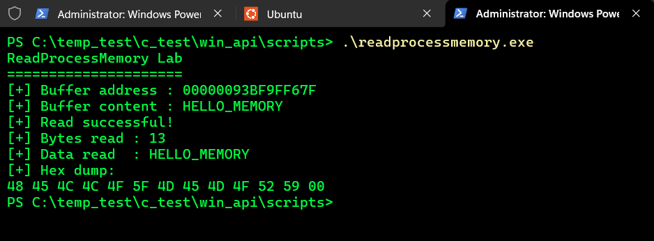
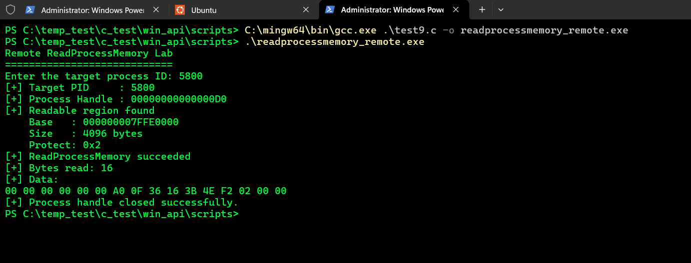

# 1. --- `ReadProcessMemory()`

## What was tested

A small C program was created to demonstrate the basic operation of
`ReadProcessMemory()`.

The program created a known string in its own process memory:

```c
char secret[] = "HELLO_MEMORY";
```

The address of this buffer was printed:

```
printf("[+] Buffer address : %p\n", (void*)secret);
```

The current process handle was then obtained:

```
HANDLE hProcess = GetCurrentProcess();
```

ReadProcessMemory() was used to read the contents of the buffer into
a separate local buffer:

```
char buffer[32] = {0};
SIZE_T bytesRead = 0;

BOOL result = ReadProcessMemory(
    hProcess,
    (LPCVOID)secret,
    buffer,
    sizeof(secret),
    &bytesRead
);
```

## C File

[ReadProcessMemory](../scripts/test8.c)


## Observed Output

```
ReadProcessMemory Lab
=====================
[+] Buffer address : 00000093BF9FF67F
[+] Buffer content : HELLO_MEMORY
[+] Read successful!
[+] Bytes read : 13
[+] Data read  : HELLO_MEMORY
[+] Hex dump:
48 45 4C 4C 4F 5F 4D 45 4D 4F 52 59 00
```




## What was learned

ReadProcessMemory() reads bytes from the virtual address space of
the process represented by the supplied handle.

The basic operation can be represented as:

```
Process Memory
      |
      | address
      v
[ HELLO_MEMORY ]
      |
      | ReadProcessMemory()
      v
Local Buffer
      |
      v
[ HELLO_MEMORY ]
```

The experiment also demonstrated that the number of bytes actually read
is returned through:

```
SIZE_T bytesRead;
```

In this test, 13 bytes were read.

The final byte:

```
00
```

is the null terminator of the C string.

The hexadecimal output therefore corresponds to:

```
48 45 4C 4C 4F 5F 4D 45 4D 4F 52 59 00
 H  E  L  L  O  _  M  E  M  O  R  Y \0
```

## Important distinction

This experiment establishes the difference between the two memory APIs
studied so far:

```
VirtualQueryEx()
        |
        v
Memory region metadata
```

whereas:

```
ReadProcessMemory()
        |
        v
Actual bytes stored at a memory address
```

VirtualQueryEx() tells us what a memory region is like.

ReadProcessMemory() allows us to read the contents of that
memory.

## Key Takeaways

* ReadProcessMemory() is a separate Win32 API from OpenProcess() and
VirtualQueryEx().

* A process handle is required to access the target process memory.

* A memory address identifies where the data should be read from.

* The destination buffer belongs to the calling process.
bytesRead reports how many bytes were successfully read.

* Memory contents can be inspected as raw bytes, including their
hexadecimal representation.

---

# 2. --- Remote `ReadProcessMemory()`

## What was tested

The previous lab demonstrated `ReadProcessMemory()` using memory belonging
to the current process.

This test used `OpenProcess()` to obtain a handle to another process and
then combined `VirtualQueryEx()` with `ReadProcessMemory()` to read actual
bytes from the target process.

## C File

[Remote ReadProcessMemory](../scripts/test9.c)

## Observed Output

```text
Remote ReadProcessMemory Lab
============================
Enter the target process ID: 5800
[+] Target PID     : 5800
[+] Process Handle : 00000000000000D0
[+] Readable region found
    Base   : 000000007FFE0000
    Size   : 4096 bytes
    Protect: 0x2
[+] ReadProcessMemory succeeded
[+] Bytes read: 16
[+] Data:
00 00 00 00 00 00 A0 0F 36 16 3B 4E F2 02 00 00
[+] Process handle closed successfully.
```




## What was learned

The experiment demonstrated that ReadProcessMemory() can be used to
read actual bytes from another process when the caller has an appropriate
process handle.

The APIs worked together as follows:

```
OpenProcess()
      |
      v
Target Process HANDLE
      |
      v
VirtualQueryEx()
      |
      v
Readable Memory Region
      |
      v
ReadProcessMemory()
      |
      v
Actual Memory Bytes
```

VirtualQueryEx() was used to identify a committed readable region:

```
Base   : 000000007FFE0000
Size   : 4096 bytes
Protect: 0x2
```

ReadProcessMemory() then successfully read 16 bytes from the beginning
of that region.

The returned data was:

```
00 00 00 00 00 00 A0 0F 36 16 3B 4E F2 02 00 00
```

## Key Takeaways

* OpenProcess() provides the handle used to access the target process.

* VirtualQueryEx() provides information about the target's memory
regions.

* ReadProcessMemory() reads the actual bytes stored at a virtual
address.

* A memory region being readable does not mean that its contents are
necessarily meaningful as a string or recognizable structure.

* The experiment successfully demonstrated remote process memory reading.

The combined model is:

```
Process Handle
      |
      +-- VirtualQueryEx()
      |       |
      |       +-- Memory region metadata
      |
      +-- ReadProcessMemory()
              |
              +-- Actual memory contents
```              

