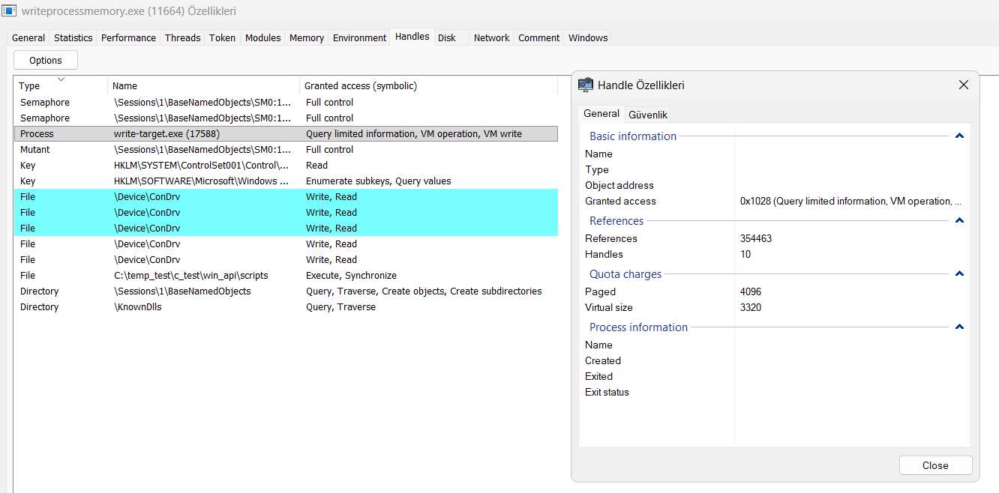

# 4. WriteProcessMemory

## What was tested

The `WriteProcessMemory()` API was used to modify data inside the virtual address space of another process.

A target process was created with a known string:

```text
BEFORE_WRITE
```

The target process printed its PID and the virtual address of the string.

A separate process then opened the target process with:

```c
PROCESS_VM_WRITE | PROCESS_VM_OPERATION
```

and wrote a new string to the target address:

```text
AFTER_WRITE
```

## C Files

[WriteProcessMemory Target](../scripts/write-target.c)

[WriteProcessMemory](../scripts/writeprocessmemory.c)

## Observed output

Target process:

```text
WriteProcessMemory Target Lab
==============================
[+] PID     : 11288
[+] Address : 00007FF6C6B24010
[+] Data    : BEFORE_WRITE

Press ENTER to exit...

[+] Final Data: AFTER_WRITE
```

Writer process:

```text
Remote WriteProcessMemory Lab
=============================
Enter target process ID: 11288
Enter target memory address (hex): 00007FF6C6B24010
[+] Target PID     : 11288
[+] Process Handle : 00000000000000D4
[+] WriteProcessMemory succeeded!
[+] Bytes written: 12
[+] Data written : AFTER_WRITE
[+] Process handle closed successfully.
```

## What was learned

`WriteProcessMemory()` writes bytes into the virtual address space of a target process.

The basic operation is:

```text
Our Process
    |
    | data
    v
WriteProcessMemory()
    |
    v
Target Process Memory
```

The experiment demonstrated that the target process can continue running while another process modifies data in its memory.

The original value:

```text
BEFORE_WRITE
```

was changed to:

```text
AFTER_WRITE
```

This confirmed that the write operation affected the target process's actual memory rather than only modifying a local buffer.

## Access Rights

The handle was opened with:

```c
PROCESS_VM_WRITE | PROCESS_VM_OPERATION
```

`PROCESS_VM_WRITE` allows the caller to write to the process's virtual memory.

`PROCESS_VM_OPERATION` is also required for operations involving modification of the target process's virtual memory.

The resulting model is:

```text
OpenProcess()
      |
      | PROCESS_VM_WRITE
      | PROCESS_VM_OPERATION
      v
Process HANDLE
      |
      v
WriteProcessMemory()
      |
      v
Target Virtual Memory
```

## Read vs Write

The two experiments demonstrate opposite directions of memory access:

```text
ReadProcessMemory()

Target Process
      |
      | bytes
      v
Our Process
```

and:

```text
WriteProcessMemory()

Our Process
      |
      | bytes
      v
Target Process
```

The important concept is that both operations operate on the target process's virtual address space through a process `HANDLE` with the appropriate access rights.

## Detection Engineering Notes

### Sysmon Event ID 10 correlation

The `OpenProcess()` call in this test requested `PROCESS_VM_WRITE | PROCESS_VM_OPERATION` (`0x28`). The corresponding Sysmon EID 10 (ProcessAccess) event, however, logged:

```text
GrantedAccess: 0x1028
```

This is `0x28` plus an additional `PROCESS_QUERY_LIMITED_INFORMATION` (`0x1000`) that was not explicitly requested in code.

### Kernel-level verification

To confirm whether this extra bit came from Sysmon's logging layer or from the actual kernel-granted access, the live handle was inspected directly with Process Hacker while the writer process was paused in x64dbg immediately after the `OpenProcess()` return:

```text
Process, write-target.exe (17588), Query limited information, VM operation, VM write
```

This matches `0x1000 + 0x0008 + 0x0020 = 0x1028` exactly — the same value Sysmon logged. Since Process Hacker reads the handle table directly from the kernel object, independent of Sysmon, this confirms the extra bit is granted by the kernel's access check itself, not added by Sysmon's event generation.



### Takeaway

The `DesiredAccess` parameter passed to `OpenProcess()` does not reliably predict the `GrantedAccess` value observed in telemetry. The Windows kernel access-check path can grant additional rights (`PROCESS_QUERY_LIMITED_INFORMATION` in this case) beyond what was explicitly requested. Detection rules should be built from the **observed** `GrantedAccess` value in the lab environment rather than from a value calculated purely from the source code's access mask flags.

Sysmon also performs a literal string comparison on `GrantedAccess`, not a bitwise operation — the exact hex value must be matched.

Verified rule for this test case:

```xml
<RuleGroup name="" groupRelation="and">
  <ProcessAccess onmatch="include">
    <TargetImage condition="end with">write-target.exe</TargetImage>
    <GrantedAccess condition="is">0x1028</GrantedAccess>
  </ProcessAccess>
</RuleGroup>
```