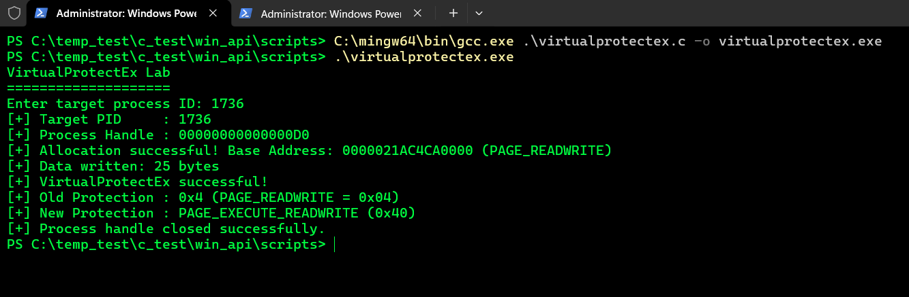

# 6. VirtualProtectEx and Memory Protection Modification
What was tested

The VirtualProtectEx() API was used to modify the page protection attributes of an existing virtual memory region inside a target process (Notepad.exe, PID 1736).

First, a 4096-byte memory page was allocated as read-write (PAGE_READWRITE / 0x04) using VirtualAllocEx() and populated via WriteProcessMemory().

Then, VirtualProtectEx() changed the access permissions of that allocated region to executable, readable, and writable (PAGE_EXECUTE_READWRITE / 0x40).

The process handle was acquired with:

```
PROCESS_VM_OPERATION | PROCESS_VM_WRITE
```
The call executed as follows:

```
DWORD oldProtect = 0;
BOOL protectResult = VirtualProtectEx(
    hProcess,
    allocatedAddress,
    regionSize,
    PAGE_EXECUTE_READWRITE,
    &oldProtect
);
```

## C Files

[VirtualProtectEx](../scripts/virtualprotectex.c)

## Observed output

Console Output:

```
VirtualProtectEx Lab
====================
Enter target process ID: 1736
[+] Target PID     : 1736
[+] Process Handle : 00000000000000D0
[+] Allocation successful! Base Address: 0000021AC4CA0000 (PAGE_READWRITE)
[+] Data written: 25 bytes
[+] VirtualProtectEx successful!
[+] Old Protection : 0x4 (PAGE_READWRITE = 0x04)
[+] New Protection : PAGE_EXECUTE_READWRITE (0x40)
[+] Process handle closed successfully.
```




## What was learned

VirtualProtectEx() alters the protection flags of committed pages in the virtual address space of a target process.

The sequence flow is:

```
Our Process
    |
    | OpenProcess(PROCESS_VM_OPERATION | PROCESS_VM_WRITE)
    v
Target Process Address Space
    |
    | 1. VirtualAllocEx()  --> PAGE_READWRITE (0x04)
    | 2. WriteProcessMemory() --> Write Payload
    | 3. VirtualProtectEx() --> PAGE_EXECUTE_READWRITE (0x40)
    v
Executable Remote Memory Page (0x0000021AC4CA0000)
```


## Key takeaways:

* Evasion & Execution Staging: Attackers often write shellcode into a non-executable page (PAGE_READWRITE) to bypass basic write-monitoring heuristics, then transition the page to executable (PAGE_EXECUTE_READ or PAGE_EXECUTE_READWRITE) right before execution.

* Old Protection Capture: The API forces the retrieval of the previous protection state (oldProtect), returning 0x04 (PAGE_READWRITE), proving that the transition occurred dynamically.


## Access Rights

The handle was opened with:

```
PROCESS_VM_OPERATION | PROCESS_VM_WRITE
```

PROCESS_VM_OPERATION (0x0008) is strictly required by VirtualProtectEx(). Modifying page attributes alters the target process's virtual memory management structures, which fails without this right.

```
OpenProcess()
      |
      | PROCESS_VM_OPERATION (0x0008)
      v
Process HANDLE
      |
      v
VirtualProtectEx()
      |
      v
Page Table Entry (PTE) Modified -> RWX (0x40)
```


## Memory Inspection Verification

Memory verification using Process Hacker / System Informer confirmed:

* Base Address: 0x0000021AC4CA0000

* Protection State: RWX (Private: Commit)

* Data Verification: ASCII readout displaying Hello, VirtualProtectEx!.

.png)