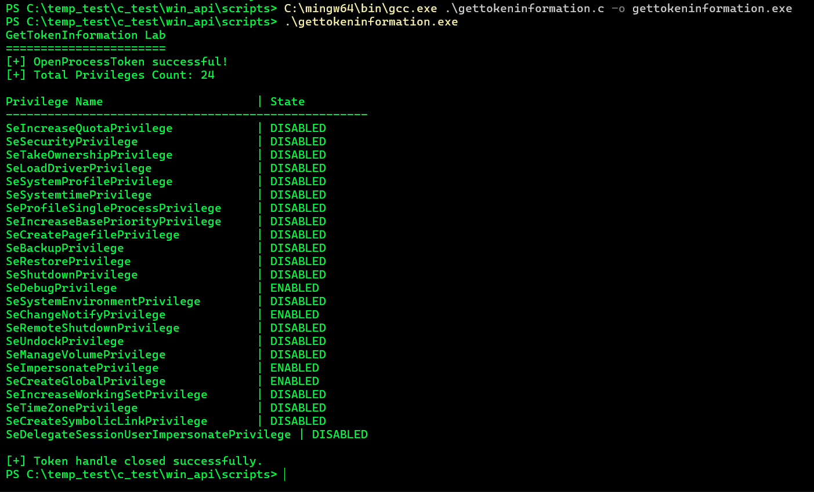
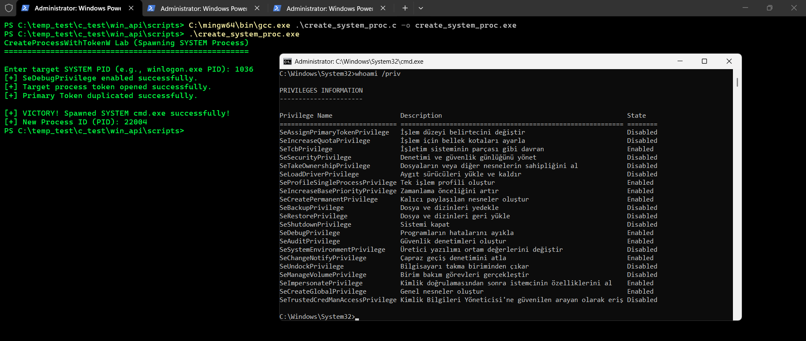
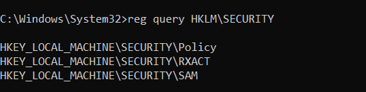
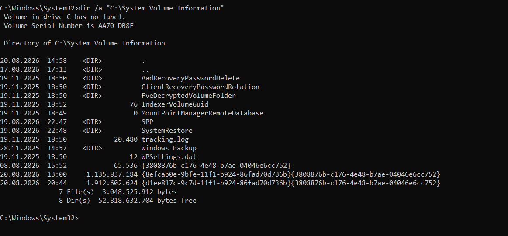

# 7.1 OpenProcessToken and Process Access Token Retrieval

## What was tested

The OpenProcessToken() API was used to open the primary access token associated with the current running process (openprocesstoken.exe).

The pseudo-handle for the current process was retrieved using GetCurrentProcess() (FFFFFFFFFFFFFFFF) and passed to OpenProcessToken() with TOKEN_QUERY (0x0008) access rights.

```
HANDLE hToken = NULL;
BOOL result = OpenProcessToken(
    GetCurrentProcess(),
    TOKEN_QUERY,
    &hToken
);
```

## C Files

[OpenProcessToken](../scripts/openprocesstoken.c)

## Observed output

Console Output:

```
OpenProcessToken Lab
====================
[+] OpenProcessToken successful!
[+] Current Process Handle : FFFFFFFFFFFFFFFF
[+] Access Token Handle    : 0000000000000100
[+] Token handle closed successfully.
```

## What was learned

OpenProcessToken() serves as the gateway to the security context of a Windows process.

```
GetCurrentProcess()
      |
      | Pseudo Handle (-1 / 0xFFFFFFFFFFFFFFFF)
      v
OpenProcessToken(TOKEN_QUERY)
      |
      v
Access Token HANDLE (0x0000000000000100)
      |
      +---> Security Context (User SID, Group SIDs, Privileges)
```

## Key takeaways:

* Pseudo Handle Behavior: GetCurrentProcess() returns a constant pseudo-handle (-1) representing the caller process. It does not create an entry in the kernel handle table, minimizing overhead.

* Token Query Capability: Acquiring a handle with TOKEN_QUERY allows subsequent inspection of the token's internal fields (e.g., via GetTokenInformation()) without permitting modifications.

* Prerequisite for Privilege Checks: Obtaining a token handle is the initial step required before inspecting user privileges, checking Integrity Levels, or attempting token elevation/impersonation.


## Access Rights

The token was opened using:

```
TOKEN_QUERY
```

TOKEN_QUERY (0x0008) grants the rights required to query token information such as the user SID, active groups, privileges, and token type.

```
Process Handle
      |
      | OpenProcessToken() with TOKEN_QUERY
      v
Token Handle
      |
      v
GetTokenInformation() [Querying Privileges / Integrity]
```

---

# 7.2 Token Privilege Inspection via GetTokenInformation

## What was tested

The GetTokenInformation() API was used to query the privilege set (TokenPrivileges) associated with the current process access token.

After obtaining a token handle via OpenProcessToken() with TOKEN_QUERY, a two-pass query pattern was implemented:

* The initial call to GetTokenInformation() determined the exact memory allocation size needed for the TOKEN_PRIVILEGES structure.

* After dynamic memory allocation, the second call populated the structure containing LUIDs and attribute flags.

Finally, LookupPrivilegeNameA() translated each numerical LUID into its human-readable Win32 privilege string (e.g., SeDebugPrivilege).

```
GetTokenInformation(
    hToken,
    TokenPrivileges,
    pPrivileges,
    tokenInfoLength,
    &tokenInfoLength
);
```

## C Files

[GetTokenInformation](../scripts/gettokeninformation.c)

## Observed output



## What was learned

GetTokenInformation() provides granular visibility into the privileges assigned to an Access Token.

The inspection workflow is:

```
OpenProcessToken(TOKEN_QUERY)
      |
      v
GetTokenInformation(Length Query) --> Returns Required Buffer Size
      |
      v
malloc(tokenInfoLength)
      |
      v
GetTokenInformation(Data Query)   --> Returns LUID Array & Attributes
      |
      v
LookupPrivilegeNameA()             --> Resolves LUIDs to Human-Readable Names
```

## Key takeaways:

* Two-Pass Query Pattern: Many Windows APIs handling variable-length structures require an initial call with a NULL buffer to retrieve the necessary memory allocation size (tokenInfoLength).

* Active vs. Passive Privileges: A privilege present in a token can be in a DISABLED state (0x0) or SE_PRIVILEGE_ENABLED state (0x2). Privileges must be explicitly enabled before performing restricted system operations.

* Security Critical Privileges: Key security privileges were identified as enabled:

    SeDebugPrivilege: Allows attaching to and debugging high-integrity/system processes.

    SeImpersonatePrivilege: Enables impersonating other client security contexts (critical vector in local privilege escalation exploits).


## Access Rights

The token handle required:

```
TOKEN_QUERY
```

TOKEN_QUERY (0x0008) is the exact access right required to pass a token handle into GetTokenInformation().


---

# 7.3 Privilege Boundaries and PPL Enforcement Analysis via AdjustTokenPrivileges

Executive SummaryThis experiment evaluated the operational boundaries of AdjustTokenPrivileges() across distinct execution integrity levels (Medium vs. High Integrity) and analyzed modern Windows Kernel defensive mechanisms, specifically Protected Process Light (PPL) enforcement on critical system processes (lsass.exe, services.exe).

The empirical testing proved two primary security concepts:

* Unassigned Privilege Boundary: AdjustTokenPrivileges() cannot enable a privilege (SeDebugPrivilege) if its corresponding LUID is absent from the primary access token's privilege table (Standard User / Medium Integrity context).

* Kernel PPL Defense-in-Depth: Even when SeDebugPrivilege is successfully toggled to SE_PRIVILEGE_ENABLED in an elevated process token (High Integrity context), Windows 
Kernel PPL mechanics actively block process handle acquisition (OpenProcess) against protected system binaries.

## Technical Analysis & Test Execution

### Test Case A: Standard User Context (Medium Integrity Level)

Methodology

The compiled executable (adjusttokenprivileges.exe) was launched from an unprivileged PowerShell session. The binary attempted to:

* Issue OpenProcess() against PID 1112 (lsass.exe) and PID 1056 (services.exe) using PROCESS_QUERY_INFORMATION | PROCESS_VM_READ access masks without modifying token privileges.

* Request TOKEN_ADJUST_PRIVILEGES access and invoke AdjustTokenPrivileges() to enable SeDebugPrivilege.

Code Excerpt

```
TOKEN_PRIVILEGES tp;
tp.PrivilegeCount = 1;
tp.Privileges[0].Luid = luid;
tp.Privileges[0].Attributes = SE_PRIVILEGE_ENABLED;

if (!AdjustTokenPrivileges(hToken, FALSE, &tp, sizeof(TOKEN_PRIVILEGES), NULL, NULL) || 
    GetLastError() == ERROR_NOT_ALL_ASSIGNED) {
    printf("[-] AdjustTokenPrivileges failed! Run terminal as Administrator.\n");
}
```

## Observed Output

```
PS C:\temp_test\c_test\win_api\scripts> .\adjusttokenprivileges.exe
AdjustTokenPrivileges REAL PROOF LAB
===================================
Enter target LSASS PID: 1112

--- STAGE 1: OpenProcess WITHOUT SeDebugPrivilege ---
[-] FAILED AS EXPECTED! Error Code: 5
[!] REASON: ERROR_ACCESS_DENIED (5). Kernel blocked us because SeDebugPrivilege is NOT enabled!

--- STAGE 2: Enabling SeDebugPrivilege via AdjustTokenPrivileges ---
[-] AdjustTokenPrivileges failed! Run terminal as Administrator.

PS C:\temp_test\c_test\win_api\scripts> .\adjusttokenprivileges.exe
AdjustTokenPrivileges REAL PROOF LAB
===================================
Enter target LSASS PID: 1056

--- STAGE 1: OpenProcess WITHOUT SeDebugPrivilege ---
[-] FAILED AS EXPECTED! Error Code: 5
[!] REASON: ERROR_ACCESS_DENIED (5). Kernel blocked us because SeDebugPrivilege is NOT enabled!

--- STAGE 2: Enabling SeDebugPrivilege via AdjustTokenPrivileges ---
[-] AdjustTokenPrivileges failed! Run terminal as Administrator.
```

## Key Findings

* Pre-Adjustment Failure (Stage 1): OpenProcess() returned ERROR_ACCESS_DENIED (5) because standard tokens lack debugging rights over high-privilege targets.

* Adjustment Failure (Stage 2): AdjustTokenPrivileges() returned ERROR_NOT_ALL_ASSIGNED (1300). Windows Kernel explicitly rejects privilege toggling when the requested LUID is not present in the caller's token allocation table.

## Test Case B: Elevated Administrator Context (High Integrity Level)

Methodology

The executable was run inside an elevated administrative session (Run as Administrator). The access token contained SeDebugPrivilege in an initially inactive state.

The execution flow:

* Attempted OpenProcess() without enabling SeDebugPrivilege.

* Successfully toggled SeDebugPrivilege to SE_PRIVILEGE_ENABLED via AdjustTokenPrivileges().

* Re-attempted OpenProcess() against PID 1112 (lsass.exe) and PID 1056 (services.exe).

## Observed Output

```
PS C:\temp_test\c_test\win_api\scripts> .\adjusttokenprivileges.exe
AdjustTokenPrivileges REAL PROOF LAB
===================================
Enter target LSASS PID: 1112

--- STAGE 1: OpenProcess WITHOUT SeDebugPrivilege ---
[-] FAILED AS EXPECTED! Error Code: 5
[!] REASON: ERROR_ACCESS_DENIED (5). Kernel blocked us because SeDebugPrivilege is NOT enabled!

--- STAGE 2: Enabling SeDebugPrivilege via AdjustTokenPrivileges ---
[+] SUCCESS: SeDebugPrivilege is now ACTIVE in process token!

--- STAGE 3: OpenProcess WITH SeDebugPrivilege ENABLED ---
[-] Still Failed! Error Code: 5

PS C:\temp_test\c_test\win_api\scripts> Get-Process services | Select-Object Id, ProcessName

  Id ProcessName
  -- -----------
1056 services

PS C:\temp_test\c_test\win_api\scripts> .\adjusttokenprivileges.exe
AdjustTokenPrivileges REAL PROOF LAB
===================================
Enter target LSASS PID: 1056

--- STAGE 1: OpenProcess WITHOUT SeDebugPrivilege ---
[-] FAILED AS EXPECTED! Error Code: 5
[!] REASON: ERROR_ACCESS_DENIED (5). Kernel blocked us because SeDebugPrivilege is NOT enabled!

--- STAGE 2: Enabling SeDebugPrivilege via AdjustTokenPrivileges ---
[+] SUCCESS: SeDebugPrivilege is now ACTIVE in process token!

--- STAGE 3: OpenProcess WITH SeDebugPrivilege ENABLED ---
[-] Still Failed! Error Code: 5
```

## Key Findings

* Successful Privilege Toggle (Stage 2): AdjustTokenPrivileges() completed with ERROR_SUCCESS, shifting the SeDebugPrivilege attribute flag to SE_PRIVILEGE_ENABLED (0x2).

* Kernel PPL Enforcement (Stage 3): Despite possessing an active SeDebugPrivilege token bitmask, OpenProcess() failed with ERROR_ACCESS_DENIED (5).

* Root Cause Analysis: Modern Windows kernels protect critical binaries (lsass.exe, services.exe) using Protected Process Light (PPL / RunAsPPL). Access checks for PPL processes bypass standard Discretionary Access Control Lists (DACLs) and token privileges, requiring specific ELAM/Microsoft code-signing certificates or kernel-level drivers to bypass.

## Architectural Comparison Matrix

| Context / Integrity Level | Target Process | SeDebugPrivilege Status in Token | AdjustTokenPrivileges Result | OpenProcess Result | Primary Blocking Mechanism |
| :--- | :--- | :--- | :--- | :--- | :--- |
| **Medium Integrity** (Standard User) | `lsass.exe` / `services.exe` | **Absent** (No LUID entry) | **FAILED** (`ERROR_NOT_ALL_ASSIGNED` / 1300) | **FAILED** (`ERROR_ACCESS_DENIED` / 5) | Token Privilege Mask Boundary |
| **High Integrity** (Administrator) | `lsass.exe` / `services.exe` | **Present** (Toggled to `ENABLED`) | **SUCCESS** (`ERROR_SUCCESS` / 0) | **FAILED** (`ERROR_ACCESS_DENIED` / 5) | **Kernel PPL** (Protected Process Light) |

---

# 7.4  Access Token Impersonation & Integrity Level Boundaries Analysis

## Executive Summary

This report documents the empirical evaluation of Windows Access Token manipulation, specifically focusing on **Token Impersonation (Admin to SYSTEM)**, **Thread-Level vs. Process-Level Token Contexts**, and Kernel-level enforcement boundaries including **Protected Process Light (PPL)**.

The tests demonstrated that while an elevated process (High Integrity) can successfully steal and impersonate a SYSTEM Access Token at the thread level using Win32 APIs, certain privileged kernel operations (such as OpenProcess calls against protected targets) validate the primary process token rather than the thread impersonation token, resulting in security enforcement checks.


## Win32 API Execution Chain
The implementation follows the classic token duplication and impersonation workflow commonly observed in administrative utilities and post-exploitation frameworks:

* **Enable Privileges:** `AdjustTokenPrivileges` is invoked to enable `SeDebugPrivilege` in the calling process token.
* **Open Target Process:** `OpenProcess` accesses a running target process executing under the `NT AUTHORITY\SYSTEM` context (e.g., `winlogon.exe`, PID 1036).
* **Retrieve Process Token:** `OpenProcessToken` retrieves a handle to the primary token with `TOKEN_DUPLICATE | TOKEN_QUERY` access rights.
* **Duplicate Access Token:** `DuplicateTokenEx` creates a secondary impersonation token with `SecurityImpersonation` level.
* **Apply Impersonation Token:** `ImpersonateLoggedOnUser` assigns the duplicated token to the calling thread.
* **Context Reversion:** `RevertToSelf` clears the thread token and restores the original primary process identity.


## Empirical Test Results

## C File 

[Impersonate Token](../scripts/impersonatetoken.c)

### Token Impersonation Test Output
Execution of `impersonatetoken.exe` targeting `winlogon.exe` (PID 1036):

```text
Token Impersonation Lab (Admin to SYSTEM)
=========================================

Enter target SYSTEM PID (e.g., winlogon.exe or spoolsv.exe): 1036

[*] Current User Context (BEFORE IMPERSONATION): Tevfik Turkoglu
[+] SeDebugPrivilege enabled successfully.
[+] Successfully opened target process token.
[+] Token duplicated successfully (SecurityImpersonation).

[+] BOOM! Impersonation Successful!
[*] Current User Context (DURING IMPERSONATION): SYSTEM

[+] RevertToSelf executed. Dropping the mask...
[*] Current User Context (AFTER REVERT): Tevfik Turkoglu

[+] Lab completed successfully.
```

## 3.2 Subsequent Privilege Check & PPL Enforcement Output

Re-testing OpenProcess calls against lsass.exe (PID 1112) and services.exe (PID 1056) following thread-level impersonation:  

```
AdjustTokenPrivileges REAL PROOF LAB
===================================
Enter target LSASS PID: 1112

--- STAGE 1: OpenProcess WITHOUT SeDebugPrivilege ---
[-] FAILED AS EXPECTED! Error Code: 5
[!] REASON: ERROR_ACCESS_DENIED (5). Kernel blocked us because SeDebugPrivilege is NOT enabled!

--- STAGE 2: Enabling SeDebugPrivilege via AdjustTokenPrivileges ---
[+] SUCCESS: SeDebugPrivilege is now ACTIVE in process token!

--- STAGE 3: OpenProcess WITH SeDebugPrivilege ENABLED ---
[-] Still Failed! Error Code: 5
```

## Technical Breakdown & Security Analysis

### Thread-Level Impersonation vs. Primary Process Token

Windows architecture distinguishes between two types of tokens[cite: 1]:

* Primary Token: Defines the security context of the process executable itself. Created when the process is initialized[cite: 1].

* Impersonation Token: Temporarily assigned to an individual thread to perform actions on behalf of another user context[cite: 1].When ImpersonateLoggedOnUser is called, the system sets a thread impersonation token[cite: 1]. 

APIs evaluating thread context (such as GetUserNameA or file/registry access checks) report NT AUTHORITY\SYSTEM[cite: 1]. However, specific Kernel routines—including OpenProcess when targeting sensitive system structures—specifically evaluate the Primary Process Token, ignoring the thread's impersonation token[cite: 1].


## Comparative Matrix

| Execution Context | Primary Token | Thread Token | GetUserNameA Output | OpenProcess (LSASS/Services) Result | Root Cause |
| :--- | :--- | :--- | :--- | :--- | :--- |
| **Standard User** (Medium) | User SID | None | User | FAILED (Error 5) | Missing `SeDebugPrivilege` in Token LUID Table |
| **Elevated Admin** (High) | Admin SID | None | Admin | FAILED (Error 5) | Kernel PPL Protection Enforcement |
| **Thread Impersonated** | Admin SID | SYSTEM SID | SYSTEM | FAILED (Error 5) | Kernel inspects Primary Token & PPL boundaries |


---

# 7.5 Spawning SYSTEM Processes via Primary Token Duplication (CreateProcessWithTokenW)

## What was tested

To overcome the architectural limitation of Thread-Level Impersonation (where OpenProcess evaluates the primary process identity rather than the thread impersonation token), a primary token duplication attack vector was implemented.

The objective was to extract a Primary Token from a running SYSTEM process (winlogon.exe), duplicate it using DuplicateTokenEx as TokenPrimary, and instantiate a native cmd.exe sub-shell running entirely under the NT AUTHORITY\SYSTEM context.

## Execution Flow

```
OpenProcess(winlogon.exe) 
      |
      v
OpenProcessToken(TOKEN_DUPLICATE | TOKEN_ASSIGN_PRIMARY)
      |
      v
DuplicateTokenEx(..., TokenPrimary)  <-- Key Difference: Creates Primary Token, NOT Impersonation Token
      |
      v
CreateProcessWithTokenW(hPrimaryToken, ..., "cmd.exe")
      |
      v
Spawned Child Process (PID: 22004) under NT AUTHORITY\SYSTEM Context
```

## C Source Code


## Observed Output

Host Execution:

```
Enter target SYSTEM PID (e.g., winlogon.exe PID): 1036
[+] SeDebugPrivilege enabled successfully.
[+] Target process token opened successfully.
[+] Primary Token duplicated successfully.

[+] VICTORY! Spawned SYSTEM cmd.exe successfully!
[+] New Process ID (PID): 22004
```

Spawned cmd.exe Context (whoami /priv):



## Key Architectural Learnings

Impersonation Token vs. Primary Token Spawning

| Mechanism | Target Scope | Win32 API Used | Kernel Access Checks Evaluation | Primary Process Identity |
| :--- | :--- | :--- | :--- | :--- |
| **Thread Impersonation** | Calling Thread Only | `ImpersonateLoggedOnUser` / `SetThreadToken` | Mixed (Evaluates Primary Token for Process Access / Thread for Access Checks) | Unchanged (Admin / User) |
| **Primary Token Spawning** | Entire Child Process | `CreateProcessWithTokenW` / `CreateProcessAsUserW` | Pure `SYSTEM` Context across all Kernel validation layers | Swapped (`NT AUTHORITY\SYSTEM`) |


## Overview

To validate that spawning a process via CreateProcessWithTokenW achieves true NT AUTHORITY\SYSTEM primary token execution (rather than thread-level impersonation), privileged post-exploitation queries were executed against access-controlled OS structures.

Unlike standard Elevated Administrator accounts (High Integrity) which are restricted by explicit Discretionary Access Control Lists (DACLs) on system structures, the newly spawned shell executed commands with full kernel-level permissions.

## Execution Outputs

Test 1: Querying Protected LSA Hive (HKLM\SECURITY)

Standard Administrators are denied access to the HKLM\SECURITY registry hive. Executing reg query under the spawned SYSTEM shell successfully enumerated the internal subkeys:



Test 2: Accessing System Volume Information Directory

The C:\System Volume Information directory contains system restore points, shadow copies, and volume metadata. Standard administrator accounts receive an Access is Denied error due to restrictive NTFS ACLs.

Executing a directory listing under the SYSTEM primary process token successfully bypassed NTFS boundaries:




## Key Security Takeaways

Definitive Context Swap: The ability to inspect HKLM\SECURITY and traverse C:\System Volume Information proves that CreateProcessWithTokenW replaced the primary process token with a genuine NT AUTHORITY\SYSTEM context.

Bypassing DACLs: Thread-level impersonation is often restricted during specific handle open requests (OpenProcess), whereas primary token swapping grants native SYSTEM privileges for all subsequent Win32/NT API calls made within that process lifecycle.