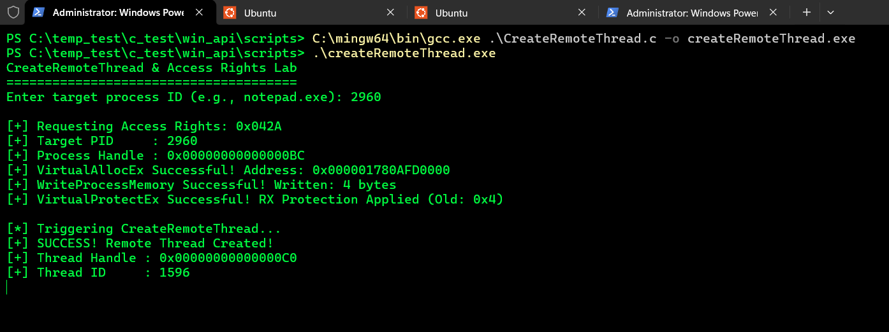
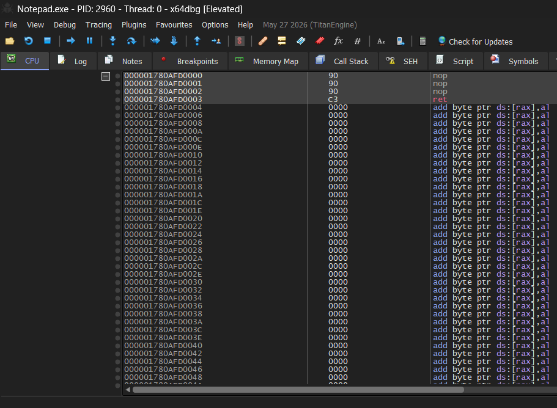
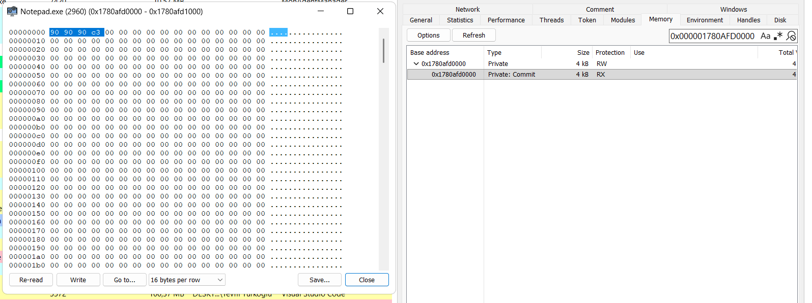
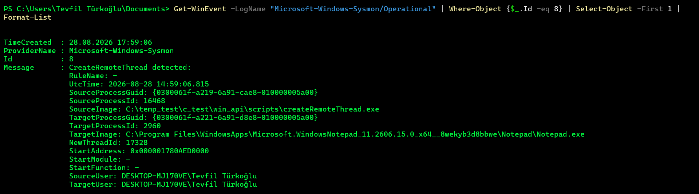

# 8. CreateRemoteThread and Remote Execution Staging

## What was tested

The CreateRemoteThread() API was used to initiate a new thread of execution inside the virtual address space of a target process (Notepad.exe).

This experiment represented the final execution trigger phase of remote process manipulation, combining the techniques explored in previous labs:

* Acquiring a process handle with execution-specific access rights (PROCESS_CREATE_THREAD | PROCESS_VM_OPERATION | PROCESS_VM_WRITE | PROCESS_QUERY_INFORMATION).

* Allocating a 4096-byte memory region using VirtualAllocEx().

* Writing a harmless execution payload (90 90 90 C3 — 3x NOP instructions followed by RET) using WriteProcessMemory().

* Transitioning page protection attributes to executable (PAGE_EXECUTE_READ / 0x20) using VirtualProtectEx().

* Triggering thread execution via CreateRemoteThread().

```
HANDLE hThread = CreateRemoteThread(
    hProcess,
    NULL,
    0,
    (LPTHREAD_START_ROUTINE)remoteAddress,
    NULL,
    0,
    &threadId
);
```

## C File 

[CreateRemoteThread](../scripts/CreateRemoteThread.c)

## Observed Output




## Debugger & Memory Analysis (x64dbg & System Informer)

To verify execution and memory structures independent of API return codes, live process inspection was performed using x64dbg and System Informer (Process Hacker).

### 1. Disassembly Verification in x64dbg

Attaching x64dbg prior to execution and inspecting base address 0x000001780AFD0000 confirmed the exact assembly instructions injected into Notepad.exe: 

```
000001780AFD0000 | 90 | nop
000001780AFD0001 | 90 | nop
000001780AFD0002 | 90 | nop
000001780AFD0003 | C3 | ret
```



The 3x NOP instructions (0x90) execute without altering processor state, while RET (0xC3) gracefully terminates the thread execution context without causing an access violation (0xC0000005) or crashing the host target process.


## 2. Unbacked Memory Region Inspection

Inspecting the memory map in System Informer revealed:

* Memory Base Address: 0x000001780AFD0000

* Allocation Type: Private: Commit

* Protection State: PAGE_EXECUTE_READ (RX)

* File Backing: None (Unbacked memory region; not mapped to any disk-backed .dll or .exe image).


## 3. Thread Start Address Anomaly

Inspecting the Threads tab of Notepad.exe during execution showed:

* Thread ID: 1596

* Start Address: 0x000001780AFD0000

Legitimate threads in Windows typically start within exported functions of signed system DLLs (such as ntdll.dll!RtlUserThreadStart or kernel32.dll!BaseThreadInitThunk). A thread starting directly in a private, unbacked memory region serves as a primary behavioral indicator of remote thread injection.



## Telemetry & Detection Engineering Notes

Sysmon Event ID 8 Correlation

The execution generated a corresponding Sysmon Event ID 8 (CreateRemoteThread) event:




## Key Detection Metrics

### 1- Exact Identifier Alignment:
   
   * Allocated Address: 0x000001780AED0000 $\leftrightarrow$ Sysmon StartAddress: 0x000001780AED0000
   * Created Thread ID: 17328 $\leftrightarrow$ Sysmon NewThreadId: 17328

### 2- StartModule Anomaly Detection:

   * StartModule: -
   * StartFunction: -
   * Because the start address pointed to dynamically allocated memory (VirtualAllocEx) rather than an image on disk, Sysmon was unable to resolve a backing module or exported function name. In detection engineering logic, StartModule being empty (-) or pointing outside loaded image boundaries is a high-fidelity indicator of process injection.

### 3- Access Mask Evaluation:

   * Requested Mask: PROCESS_CREATE_THREAD (0x0002) | PROCESS_VM_OPERATION (0x0008) | PROCESS_VM_WRITE (0x0020) | PROCESS_QUERY_INFORMATION (0x0400) = 0x042A.
   * This represents the minimal permission set required to stage and execute code remotely.
