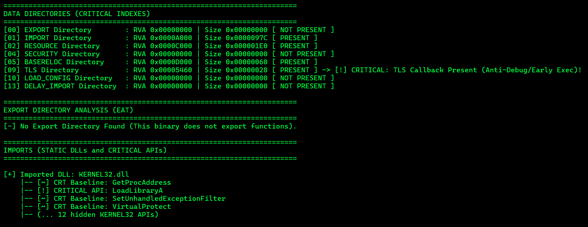
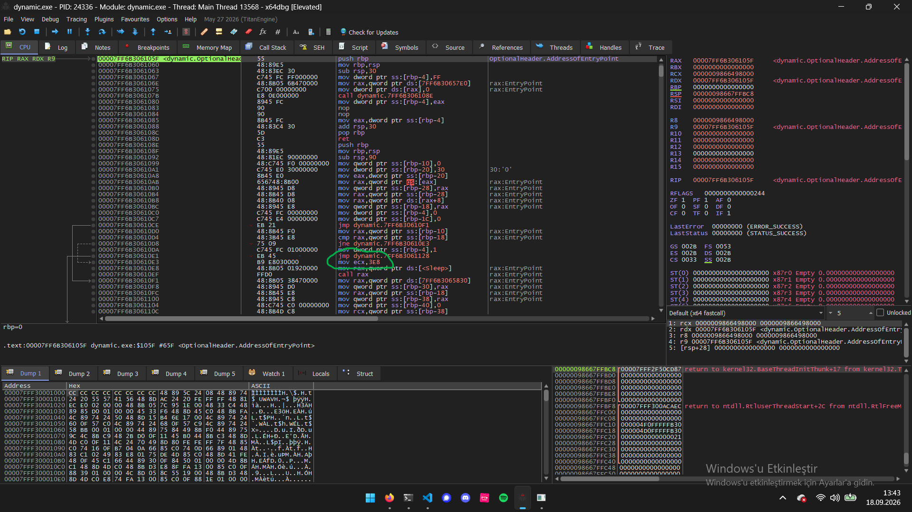
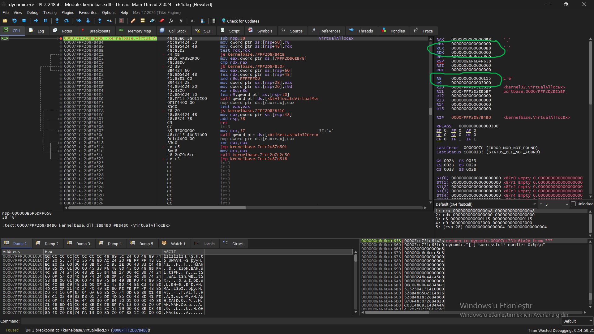
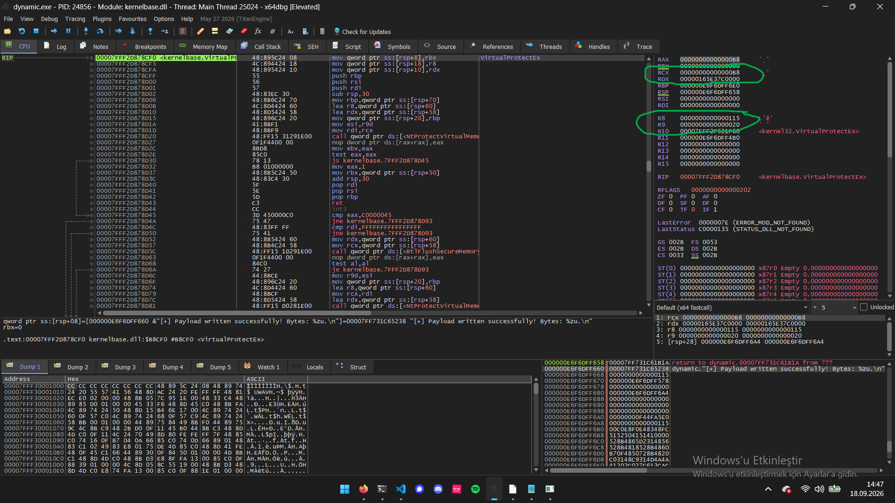
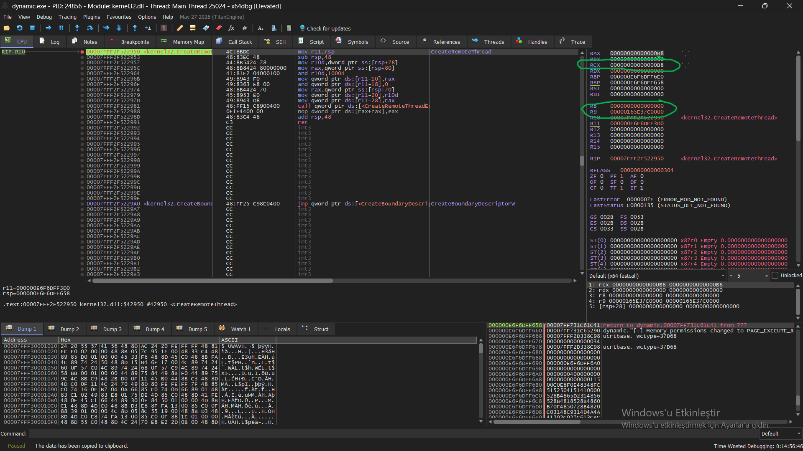

# Part 2: Dynamic API Import Method Analysis (`dynamic_crt.c`)

### 1. Static Binary Triage (pe-info-parser)

Static analysis of `dynamic.exe` reveals a structurally different profile from both prior variants:

**PE Header & Mitigation Indicators**

- Architecture: x64 (AMD64)
- Subsystem: Windows Console
- Sections: 18 (notably more than the static/hashing variants — consistent with dynamic CRT linking, see below)
- Compilation timestamp: 2026-09-18 10:28:42 UTC
- Mitigations: ASLR (ENABLED), DEP (ENABLED), High Entropy VA (ENABLED), Guard CF (DISABLED)

**Import Address Table (IAT) — partial exposure**

```
[+] Imported DLL: KERNEL32.dll
    |-- [~] CRT Baseline: GetProcAddress
    |-- [!] CRITICAL API: LoadLibraryA
    |-- [~] CRT Baseline: SetUnhandledExceptionFilter
    |-- [~] CRT Baseline: VirtualProtect
    |-- (... 12 hidden KERNEL32 APIs)
```



Critically, **`OpenProcess`, `VirtualAllocEx`, `WriteProcessMemory`, and `CreateRemoteThread` are absent from the IAT** — only the resolver primitives themselves (`LoadLibraryA`, `GetProcAddress`) are statically imported. This is the defining static signature of this technique: an analyst inspecting the IAT alone would see nothing indicating process injection capability, only the presence of `GetProcAddress` as a (weak, ubiquitous) heuristic flag.

**Forensic Note — comparison across all three variants:**

| Variant | Injection APIs in IAT | Injection API names anywhere in binary |
|---|---|---|
| Part 1 (Static) | All 4 present, plaintext | Yes (IAT) |
| Part 3 (Dynamic/GetProcAddress) | None present | Yes (`.rdata`/`.data` as plain strings — see below) |
| Part 2 (API Hashing) | None present | No — only 32-bit hash constants |

The remaining KERNEL32 imports (`SetUnhandledExceptionFilter`, `VirtualProtect`) plus the extensive `api-ms-win-crt-*.dll` import set (heap, runtime, stdio, string, environment, locale, math) reflect **dynamic Universal CRT (UCRT) linking** — a compiler/linker configuration difference from the static variant rather than an evasion-relevant artifact.

**Export Directory:** Absent, as expected for an executable (no functions are exported for external consumption).

**Critical anomaly flagged by the parser — TLS Directory present:**

```
[09] TLS Directory : RVA 0x00005460 | Size 0x00000028 [ PRESENT ]
-> [!] CRITICAL: TLS Callback Present (Anti-Debug/Early Exec)!
```

---

### 2. TLS Callback Analysis (x64dbg)

**2.1 Setup**

x64dbg was configured to break automatically on TLS callback execution (`Options → Preferences → Events → TLS Callbacks`), and the binary was launched fresh via **File → Open** (rather than attached post-launch) to ensure the callback — which executes before the image's normal entry point — was not missed.

**2.2 Callback signature and dispatch logic**

Execution paused at a location labeled `TLS Callback 2`, inside a function matching the standard TLS callback signature:
```c
VOID CALLBACK TlsCallback(PVOID DllHandle, DWORD Reason, PVOID Reserved)
```
consistent with the x64 calling convention observed in the prologue (`RCX`=DllHandle, `EDX`=Reason, `R8`=Reserved, each stored to the stack frame).

The callback's control flow branches on the `Reason` parameter:
```asm
cmp dword ptr ss:[rbp+18], 3     ; Reason == DLL_THREAD_DETACH ?
je <thread_detach_handler>

cmp dword ptr ss:[rbp+18], 0      ; Reason == DLL_PROCESS_DETACH ?
jne <no_op_exit>                    ; anything other than 0 -> skip payload entirely

; --- only reached when Reason == DLL_PROCESS_DETACH (0) ---
mov rcx, ...
mov edx, ...
mov r8, ...
call <internal_function>              ; payload invoked here
```

At the observed breakpoint hit, `RDX = 1` (`DLL_PROCESS_ATTACH`), confirming the `jne` branch was taken and the internal function call was **skipped** on this invocation — the callback executed with no observable side effect during process startup.

**2.3 Control Experiment: TLS Callback is a Compiler-Inserted Artifact, Not a Deliberate Technique**

To determine whether the TLS callback observed in `dynamic.exe` was intentionally authored by the sample (as an anti-analysis technique) or an artifact of the build toolchain, a control experiment was performed: a minimal, unrelated binary (`openproc.c` — a simple `OpenProcess` + `printf` utility with **no TLS callback declaration and no injection logic whatsoever**) was compiled with the same toolchain and loaded in `x64dbg` with TLS-callback breakpoints enabled.

The control binary **also** triggered a TLS callback breakpoint (`INT3 breakpoint "TLS Callback 1"`) despite containing no source-level reference to TLS callbacks. This confirms the callback is inserted automatically by the MSVC/CRT build toolchain (commonly related to internal CRT thread-local state initialization, e.g. stack-cookie or locale setup) rather than a deliberate anti-analysis mechanism authored by the sample.

**Correction to the earlier finding:** the deferred-execution behavior described in the original Section 3.3 (payload gated on `DLL_PROCESS_DETACH`) should not be attributed to intentional evasion design without further verification of the specific callback body against the CRT's known startup routines. This is retained as an observed *structural* characteristic of the binary rather than a confirmed evasion technique, and is a useful methodological reminder: **an artifact's presence is not evidence of intent — control experiments against unrelated binaries compiled with the same toolchain are necessary before attributing behavior to the sample under analysis rather than to its build environment.**

**2.4 Finding: `Sleep(1000)` at entry point**

Immediately following the TLS callback, at the image's actual entry point (`OptionalHeader.AddressOfEntryPoint`), a one-second delay was observed prior to `main()`:
```asm
mov ecx, 3E8          ; 1000 (ms)
mov rax, qword ptr ds:[<Sleep>]
call rax
```



This is a common, low-effort sandbox-evasion pattern intended to exhaust the observation window of automated analysis pipelines with short timeouts. It has no effect against interactive/manual debugging (a human analyst simply waits out the one-second delay), and — like the TLS-deferred-execution technique above — has no bearing on OS-level behavioral telemetry once the injection primitives are eventually invoked: Sysmon logs the resulting `ProcessAccess`/`CreateRemoteThread` events identically regardless of when, in wall-clock time, they occur.

---

### 4. Live Resolution Chain & Memory-Protection Staging (x64dbg)

**4.1 Methodology — breaking on `GetProcAddress`**

Unlike Part 2 (where no symbol existed to break on, forcing analysis of the resolver's internal control flow), `GetProcAddress` and `LoadLibraryA` remain statically imported in this variant (per Section 2) and are directly resolvable by x64dbg's symbol engine. A plain, unconditional breakpoint was set:
```
bp GetProcAddress
```
Since the injector calls `GetProcAddress` once per injection API it needs to resolve, this breakpoint fires once per lookup. At each hit, the **second parameter** (`RDX` under the x64 fastcall convention — `LPCSTR lpProcName`) was read directly; x64dbg auto-annotates this register with the plaintext string it points to, requiring no hash computation or collision handling of any kind — a direct methodological contrast to Part 2.

**4.2 Resolution chain observed**

Pressing `F9` repeatedly and recording `RDX` at each `GetProcAddress` hit captured the following sequence, in order:

| # | `RDX` (queried API name) | Notes |
|---|---|---|
| 1 | `"OpenProcess"` | `RCX` = handle to `kernel32.dll` (from preceding `LoadLibraryA`) |
| 2 | `"VirtualAllocEx"` | |
| 3 | `"WriteProcessMemory"` | |
| 4 | `"VirtualProtectEx"` | **Not present in Part 1's static call chain — see 4.3** |
| 5 | `"CreateRemoteThread"` | |

Each resolved address was verified by stepping over the `GetProcAddress` call (`F8`) and reading `RAX`, which x64dbg correctly labeled with the corresponding `kernel32` symbol in every case (e.g. `<kernel32.VirtualAllocEx>`), confirming successful, uncorrupted resolution.

**4.3 Finding: two-stage memory-protection staging (RW → RX) instead of single-step RWX**

The presence of `VirtualProtectEx` in the resolution chain — absent from the Part 1 static variant's IAT — indicated a behavioral divergence worth verifying directly against live call parameters. A breakpoint was set on the *resolved* address of each API in turn (obtained from `RAX` in 4.2) to capture the actual arguments passed at each call site, since breaking on the IAT/GetProcAddress level only reveals *which* API is being resolved, not *how* it is subsequently invoked.

**`VirtualAllocEx` call parameters (x64 fastcall + stack):**
```
RCX (hProcess)      = 0xB8
RDX (lpAddress)     = 0x0                  (NULL — let the OS choose)
R8  (dwSize)        = 0x115                (277 bytes)
R9  (flAllocationType) = 0x3000            (MEM_COMMIT | MEM_RESERVE)
[rsp+28] (flProtect)   = 0x4               (PAGE_READWRITE)
```
Return value (`RAX`): `0x165E37C0000` (allocated base address).

**Critical divergence from Part 1:** the static variant allocated memory directly as `PAGE_EXECUTE_READWRITE` (`0x40`). This variant allocates as **`PAGE_READWRITE`** (`0x4`) only — the memory is not executable at allocation time.



**`VirtualProtectEx` call parameters:**
```
RCX (hProcess)       = 0xB8                (same handle)
RDX (lpAddress)      = 0x165E37C0000         (same address returned by VirtualAllocEx)
R8  (dwSize)         = 0x115                  (same size)
R9  (flNewProtect)   = 0x20                    (PAGE_EXECUTE_READ)
```

This confirms a two-stage **allocate-write-then-protect** pattern:
```
VirtualAllocEx(..., PAGE_READWRITE=0x4)       → memory writable, not executable
WriteProcessMemory(...)                          → shellcode written
VirtualProtectEx(..., PAGE_EXECUTE_READ=0x20)     → memory made executable, no longer writable
CreateRemoteThread(..., lpStartAddress=...)         → execution begins
```



**`CreateRemoteThread` call parameters — chain closure verified:**
```
RCX (hProcess)         = 0xB8                (same handle throughout)
R9  (lpStartAddress)   = 0x165E37C0000         (identical to VirtualAllocEx's return value / VirtualProtectEx's target)
```


All four API calls share the same process handle (`0xB8`) and the same target address/size (`0x165E37C0000`, `0x115`), confirming a single, consistent injection region carried end-to-end through allocation, write, protection change, and execution.

**4.4 Significance**

This is a materially different memory-protection posture from Part 1's single-step RWX allocation. A detection rule (EDR, YARA-on-memory, or a Sysmon-based query) that keys specifically on `VirtualAllocEx` calls carrying `PAGE_EXECUTE_READWRITE` would **miss this variant entirely**, since RWX permissions never exist simultaneously with write access — the memory is writable-only, then execute-only, never both at once. This is a legitimate, low-cost evasion refinement (colloquially "W^X" — write XOR execute) over the naive single-call RWX pattern.

**However, this technique does not evade the detection logic established in Part 1, Section 5.** The `CHAINED_ACCESS_REFLECTIVE_INJECTION` Splunk query keys on Sysmon Event ID 8's `StartModule`/`StartFunction` fields being empty — i.e., the remote thread's entry point not belonging to any loaded module — a property that holds regardless of what memory-protection transitions occurred beforehand. Whether the region was RWX from the start or staged RW→RX, `CreateRemoteThread`'s start address is, in both cases, unbacked private memory. This is documented as further evidence for the report's central argument: **evasion techniques targeting static signatures, API-name visibility, timing, or memory-protection sequencing all fail to evade detection anchored on the injection primitives' unavoidable OS-level footprint** (cross-process handle acquisition + thread creation at a non-module address).