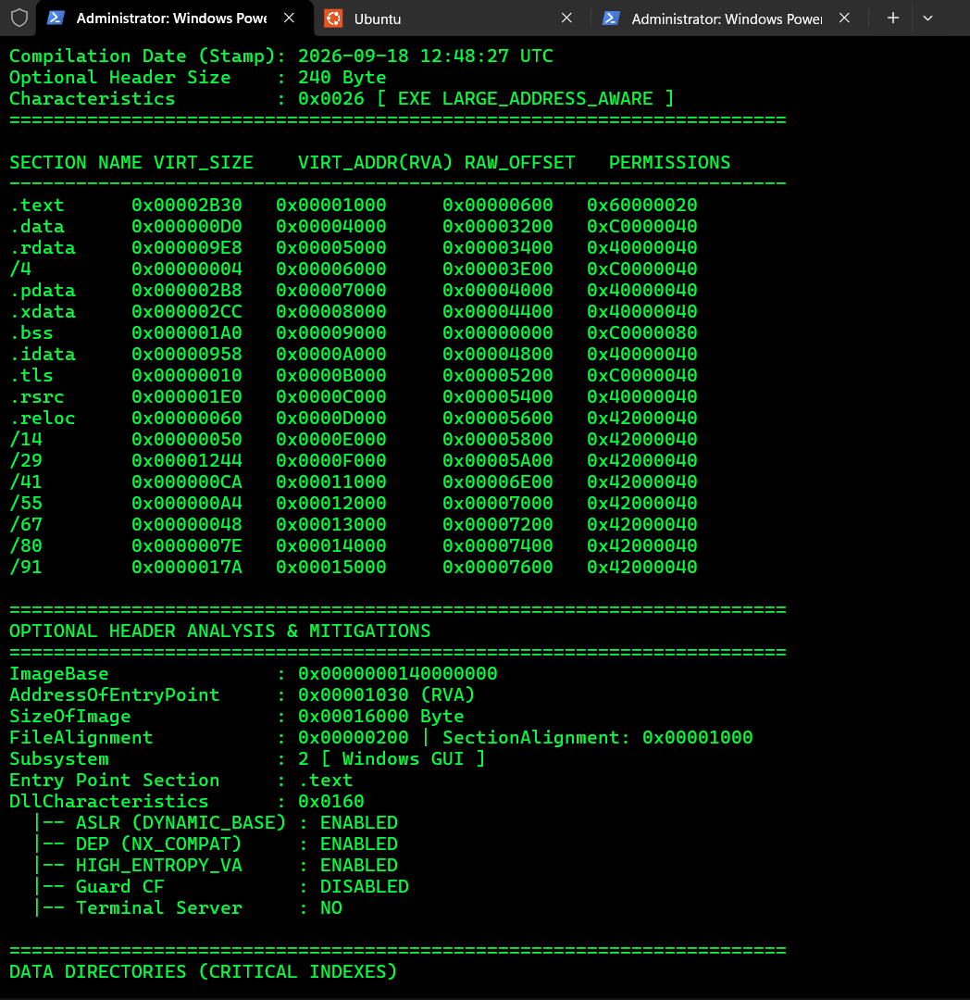
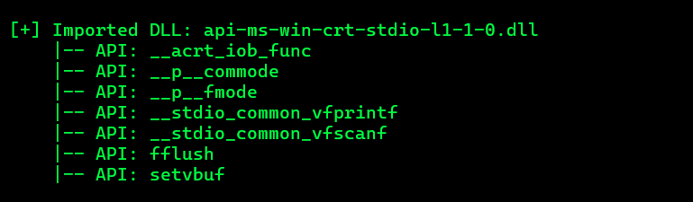
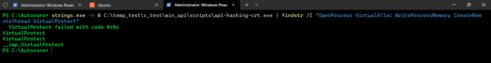
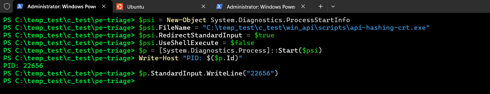
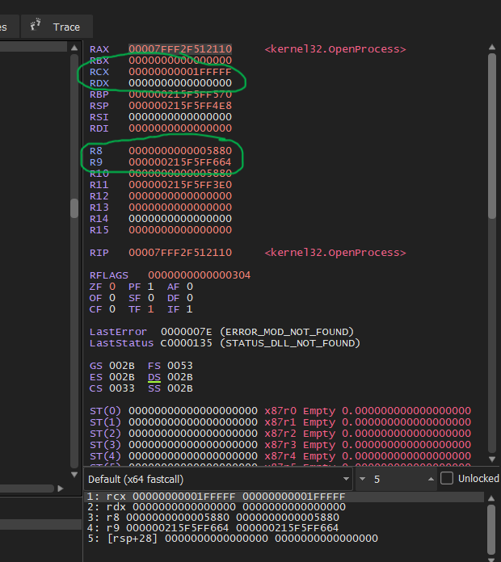
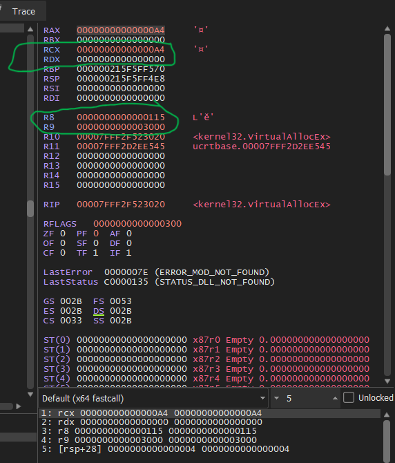
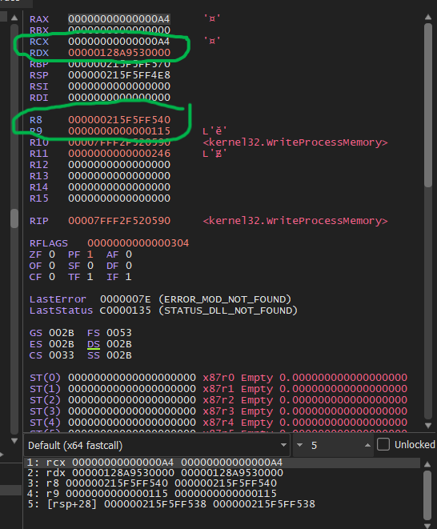
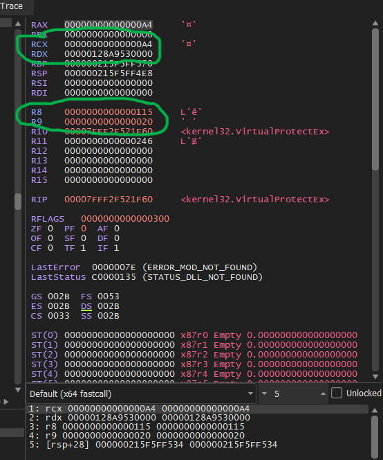
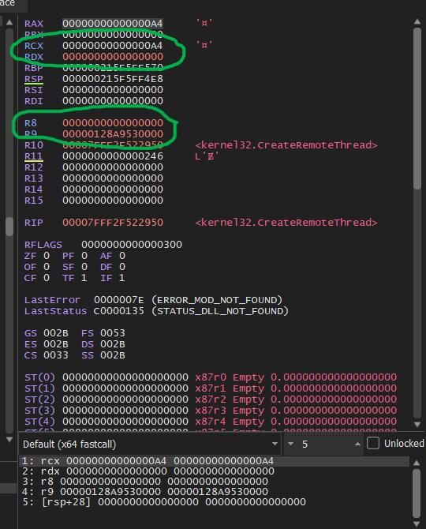

# Part 3: API Hashing + Static-CRT Method Analysis (`api_hashing_crt.c`)

### 1. Static Binary Triage (pe-info-parser)

**PE Header & Mitigation Indicators**

- Architecture: x64 (AMD64)
- Subsystem: **2 [ Windows GUI ]** — no console window spawned on execution
- Sections: 18
- Compilation timestamp: 2026-09-18 17:59:25 UTC
- Mitigations: ASLR (ENABLED), DEP (ENABLED), High Entropy VA (ENABLED), Guard CF (DISABLED)

**`.text` / `.data` / IAT size comparison against Part 3 (`dynamic.exe`)**

| Section / Metric | Part 3 (`dynamic.exe`) | Part 4 (`api-hashing-crt.exe`) |
|---|---|---|
| `.text` size | `0x00002A40` | `0x00002A40` (identical in the final build used for dynamic analysis) |
| `.data` size | `0x000000D0` | `0x000000D0` (identical) |
| `.idata` (IAT) size | `0x0000097C` | `0x0000093C` (-64 bytes) |
| "Hidden" KERNEL32 imports listed | 12 | 11 |
| Subsystem | Console | GUI |



Earlier builds of this binary (compiled before print statements and the console/GUI subsystem were finalized) showed a larger `.text` and smaller `.idata` than Part 3, consistent with extra resolver code and fewer static imports. The final build's `.text` converged to the same size as Part 3 once the surrounding CRT/print scaffolding matched -- the **`.idata` reduction (one fewer statically resolved KERNEL32 import) remained the most reliable static indicator** that this variant declares fewer imports than Part 3, consistent with resolving additional APIs at runtime rather than importing them.

**Import Address Table (IAT)**

```
[+] Imported DLL: KERNEL32.dll
    |-- [~] CRT Baseline: GetProcAddress
    |-- [!] CRITICAL API: LoadLibraryA
    |-- [~] CRT Baseline: SetUnhandledExceptionFilter
    |-- [~] CRT Baseline: VirtualProtect
    |-- (... 11 hidden KERNEL32 APIs)
```

As in Part 3, only the resolver primitives (`LoadLibraryA`, `GetProcAddress`) and a handful of CRT-baseline APIs (`SetUnhandledExceptionFilter`, `VirtualProtect`) are statically imported -- `OpenProcess`, `VirtualAllocEx`, `WriteProcessMemory`, `VirtualProtectEx`, and `CreateRemoteThread` are absent from the IAT, making this variant indistinguishable from Part 3 by IAT inspection alone.

**`__stdio_common_vfscanf` present in the CRT import set:**

```
[+] Imported DLL: api-ms-win-crt-stdio-l1-1-0.dll
    |-- API: __acrt_iob_func
    |-- API: __p__commode
    |-- API: __p__fmode
    |-- API: __stdio_common_vfprintf
    |-- API: __stdio_common_vfscanf
    |-- API: fflush
    |-- API: setvbuf
```



This confirms, before any dynamic analysis, that the binary reads formatted input via `scanf` (MinGW/UCRT routes `scanf` through this internal function) -- expected to be how the target PID is supplied, and later found to be a practical obstacle given the GUI subsystem (Section 4.1).

**TLS Directory:** Present (`RVA 0x000051A0`, size `0x28`), matching the pattern in Part 3, already established (Part 3, Section 3.3, verified via a control-compile experiment) to be a compiler/CRT-inserted artifact rather than a deliberate technique authored by the sample. Not re-investigated here.

**Export Directory:** Absent, as in all prior variants.

**CRT import set:** Same `api-ms-win-crt-*.dll` set as Part 3 (heap, runtime, stdio, string, environment, locale, math) -- dynamic UCRT linking, unrelated to the injection-primitive resolution method under investigation.

---

### 3. String-Table Verification (`strings.exe`)

To test the hypothesis that the injection primitives are not resolved via plaintext `GetProcAddress` lookups (as in Part 3), the binary was scanned for the literal API names:

```
strings.exe -n 6 api-hashing-crt.exe | findstr /I "OpenProcess VirtualAlloc WriteProcessMemory CreateRemoteThread VirtualProtect"
```

Result:



Interpretation -- distinguishing "no occurrence at all" from "statically resolvable":

None of `OpenProcess`, `VirtualAllocEx`, `WriteProcessMemory`, or `CreateRemoteThread` appear anywhere in the scanned output -- not as bare strings, and not even as substrings of a log message. This is a stronger result than Part 3, where the injection API names were absent from the IAT but still findable as substrings inside retained diagnostic messages (e.g. `"[-] OpenProcess failed! Error: %lu"`). Here, this specific `findstr` query -- which only matches the five literal API-name keywords -- returns zero hits for the four injection primitives, meaning no plaintext occurrence of their names exists anywhere `strings.exe` scanned the binary.

By contrast, `VirtualProtect` still appears three times, including once as a standalone string and once prefixed `__imp_VirtualProtect` -- a linker-generated symbol name that only exists for statically imported functions. This confirms `VirtualProtect` is conventionally, statically imported (consistent with the IAT in Section 2), while the four injection primitives show no string-level evidence whatsoever, plaintext or embedded.

Important caveat, addressed directly: the binary does still contain other diagnostic print strings observed live during dynamic analysis (Section 4) -- e.g. `"[*] Enter target process ID: "` (seen directly in `RCX` at the `printf` call site) and `[-] Failed to locate kernel32.dll base from PEB!` (seen in the disassembly of the PEB-lookup routine). Neither of these strings contains any of the five keywords this specific `findstr` query filtered for, so their existence does not contradict the result above -- but it means this binary is not fully print-free, and one point of static reasoning about the PEB-lookup routine's purpose (Section 4.3's structural identification) was corroborated by reading that adjacent print string rather than from register/parameter evidence alone. This would not hold in a genuinely print-free real-world sample; it is not, however, what established the final findings in Section 4 -- those were confirmed independently and exclusively through live parameter capture at the real, resolved API addresses, a method with no dependency on the sample's own strings.

Conclusion of static phase: the combined evidence -- IAT absence, the `.idata` reduction relative to Part 3, and the complete absence (not merely non-bare) of the four injection primitives' names anywhere in the string table -- supports the hypothesis that `OpenProcess`, `VirtualAllocEx`, `WriteProcessMemory`, `VirtualProtectEx`, and `CreateRemoteThread` are resolved via a custom mechanism rather than plaintext `GetProcAddress` calls. This is confirmed dynamically, and print-independently, in Section 4.

---

### 3. Dynamic Analysis (x64dbg)

**3.1 Obstacle: GUI subsystem removes the console, blocking `scanf`**

Launching the binary directly produces no visible window and no way to supply the target PID interactively -- `scanf` blocks waiting on a stdin handle the process does not have. Two approaches were evaluated:

- **Piped input** (`echo <pid> | api-hashing-crt.exe`): the process ran to completion (launching `calc.exe`, per the payload's final behavior) before an x64dbg attach could be completed -- too narrow a race window.
- **Controlled stdin via PowerShell** (working solution):
  ```powershell
  $psi = New-Object System.Diagnostics.ProcessStartInfo
  $psi.FileName = "...\api-hashing-crt.exe"
  $psi.RedirectStandardInput = $true
  $psi.UseShellExecute = $false
  $p = [System.Diagnostics.Process]::Start($psi)
  Write-Host "PID: $($p.Id)"
  ```
  This starts the process with `scanf` blocking indefinitely on a redirected (but not yet written) stdin pipe -- removing the time pressure entirely. x64dbg was then attached to `$p.Id` via **File -> Attach**, breakpoints were set, and only then was input supplied:
  ```powershell
  $p.StandardInput.WriteLine("<notepad PID>")
  ```

  

**3.2 Methodological dead ends (documented for completeness)**

Several approaches were attempted and abandoned before arriving at the method in 4.3:

- **Chasing the `va_list`/`arglist` pointer** to locate `&targetPid` from within `__stdio_common_vfscanf`'s own stack frame: unreliable -- the pointer chain led to unrelated heap/stack data rather than the target variable, likely due to incorrect assumptions about UCRT's internal `va_list` layout on this platform. Abandoned.
- **Hex pattern search** (searching for the byte sequence corresponding to `mov rdx, gs:[rdx+60]` seen in Part 2's hand-written shellcode) to locate the PEB-walk instruction sequence: returned no results. This is expected in hindsight -- Part 2's byte sequence came from **hand-written assembly**; this binary's equivalent logic is **compiler-generated** and is not guaranteed to use the same instruction encoding or even the same register.
- **Manual single-stepping (`F8`) through `main()`** looking for the PEB-walk pattern visually: execution outran manual tracking and the process ran to completion (payload fired, `calc.exe` launched) before the pattern was located.

**3.3 Working method: break directly on the real, resolved API -- not on the resolver**

The method that ultimately succeeded does not require locating the resolver, its hash constants, or its call site at all. Since **any** resolution method (IAT, `GetProcAddress`, or hash) must, by definition, end by transferring control to the genuine function inside `kernel32.dll` -- a module always loaded, whose export table is never obfuscated by the sample -- a breakpoint can be set directly on the real symbol:

```
bp kernel32.OpenProcess
bp kernel32.VirtualAllocEx
bp kernel32.WriteProcessMemory
bp kernel32.VirtualProtectEx
bp kernel32.CreateRemoteThread
```

x64dbg resolves these symbols against the loaded `kernel32.dll` module's own export table -- a lookup that has nothing to do with how the *target sample* locates the same address internally. This makes the technique valid regardless of whether the sample uses a plaintext IAT, `GetProcAddress`, or a custom hash routine, and requires no assumption about which APIs the sample uses beyond a reasonable initial guess (validated instantly: an unused breakpoint simply never fires).

After setting these five breakpoints and resuming (`F9`), followed by supplying the target PID via the PowerShell pipe (Section 4.1), **all five breakpoints fired in sequence**, confirming the hash-resolved addresses were genuine and correctly resolved.

Contingency, noted for completeness even though not needed in this run: these `kernel32.dll` breakpoints hit on the first attempt, but this was not guaranteed. Some injection code -- particularly malware favoring "direct syscalls" or Nt-API evasion -- resolves and calls the lower-level `ntdll.dll` native functions directly (e.g. `NtCreateThreadEx` instead of `kernel32!CreateRemoteThread`, `NtAllocateVirtualMemory` instead of `VirtualAllocEx`, `NtWriteVirtualMemory` instead of `WriteProcessMemory`, `NtProtectVirtualMemory` instead of `VirtualProtectEx`), bypassing the `kernel32.dll` wrappers entirely -- in which case a `kernel32`-only breakpoint set would never fire, incorrectly suggesting the resolver had failed or targeted something else. Had the five `kernel32` breakpoints not fired here, the correct next step would have been to set the equivalent breakpoints on `ntdll.dll`'s native counterparts (`bp ntdll.NtCreateThreadEx`, `bp ntdll.NtAllocateVirtualMemory`, `bp ntdll.NtWriteVirtualMemory`, `bp ntdll.NtProtectVirtualMemory`, plus `bp ntdll.NtOpenProcess` for the initial handle acquisition) and re-run, since `ntdll.dll` is the layer every `kernel32` wrapper itself calls into, and is therefore an even lower, unavoidable landing point regardless of which higher-level API name (if any) the sample's resolver logic targets.

**3.4 Captured call parameters, with register mapping**

Under the x64 fastcall convention, the first four integer/pointer arguments pass in `RCX, RDX, R8, R9` respectively; a fifth argument (where present) passes on the stack at `[rsp+0x28]`. Register contents were read directly at each breakpoint hit (function entry), before the call executed — the mapping below is what was actually inspected for each API, not a fixed "always check R9" rule, since each function's parameter list differs:

| API | RCX | RDX | R8 | R9 | Value(s) that mattered |
|---|---|---|---|---|---|
| `OpenProcess` | `dwDesiredAccess=0x1FFFFF` (PROCESS_ALL_ACCESS) | `bInheritHandle=0x0` | `dwProcessId=0x5880` | — | R8 = target PID, confirmed to match the notepad PID supplied via `WriteLine` |
| `VirtualAllocEx` | `hProcess=0xA4` | `lpAddress=0x0` (NULL) | `dwSize=0x115` | `flAllocationType=0x3000` | RCX = handle (tracked across all 5 calls); R8 = size, matches `WriteProcessMemory`'s `nSize` later |
| `WriteProcessMemory` | `hProcess=0xA4` | `lpBaseAddress=0x00000128A9530000` | `lpBuffer=<local stack>` | `nSize=0x115` | RDX = target address, matches `VirtualAllocEx`'s return value (RAX) from the prior call |
| `VirtualProtectEx` | `hProcess=0xA4` | `lpAddress=0x00000128A9530000` | `dwSize=0x115` | `flNewProtect=0x20` (PAGE_EXECUTE_READ) | R9 = new protection flag — the key evidence for two-stage RW→RX staging |
| `CreateRemoteThread` | `hProcess=0xA4` | (unused/0) | (unused/0) | `lpStartAddress=0x00000128A9530000` | R9 = thread entry point, matches the same region allocated/protected above |

`OpenProcess:`
  

`VirutalAllocEx:`
  

`WriteProcessMemory:`
  

`VirtualProtectEx:`
  

`CreateRemoteThread:`
  


**What was actually being verified, per call:** (1) `RCX` — is the process handle the *same* handle across all five calls (chain integrity); (2) whichever register carried the *target memory address* for that specific function (`RDX` for `WriteProcessMemory`/`VirtualProtectEx`, `R9` for `CreateRemoteThread`) — is it the *same* address every time; (3) whichever register carried a *protection flag* (`R9` for `VirtualAllocEx`'s `flAllocationType` and `VirtualProtectEx`'s `flNewProtect`) — confirming the RW-then-RX staging pattern. No single register was universally "the important one" — each function's own signature dictated which register to read.

All five calls share a single, consistent process handle (`0xA4`) and a single, consistent target region (`0x00000128A9530000`, `0x115` bytes), end to end.

**3.5 Comparison to Part 3 and significance**

| Behavior | Part 3 (`GetProcAddress`) | Part 4 (hash resolution) |
|---|---|---|
| Allocation size | `0x115` | `0x115` (identical) |
| Memory-protection staging | `VirtualAllocEx(RW)` -> `VirtualProtectEx(RX)` | `VirtualAllocEx(...)` -> `VirtualProtectEx(flNewProtect=0x20/RX)` -- same two-stage pattern |
| `CreateRemoteThread` target | Matches allocated region | Matches allocated region |
| API resolution method | Plaintext `GetProcAddress` calls | Custom ROR13-style hash routine (5 repeated calls to a single resolver address, each preceded by a distinct hardcoded hash constant -- identified statically by this repeated-call structural pattern, independent of any string evidence) |

**Conclusion:** the API-resolution method (plaintext `GetProcAddress` vs. custom hashing) is an **independent variable** from the memory-protection strategy (single-step RWX vs. two-stage RW->RX) -- this variant combines hash-based resolution with the same RW->RX staging seen in Part 3, rather than reverting to a simpler single-step RWX allocation. Both evasion techniques can be freely combined by an attacker, and -- critically -- **neither affects the OS-level behavioral telemetry** the report's detection query (Part 1, Section 5) relies on: `CreateRemoteThread`'s start address is unbacked, non-module memory in every variant tested, regardless of how the four/five APIs were located or how the target memory's protection flags were staged.