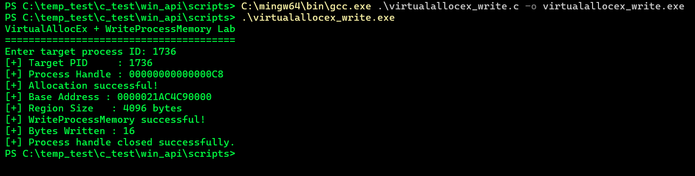
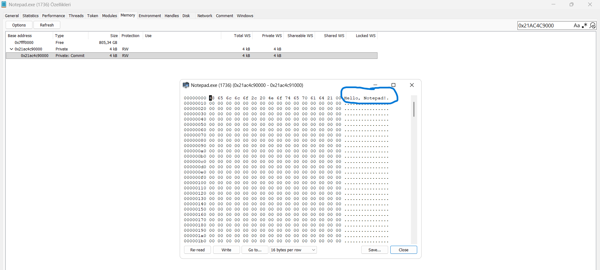

# 5. VirtualAllocEx and Remote Memory Allocation

## What was tested

The VirtualAllocEx() API was used in combination with WriteProcessMemory() to allocate a new memory region inside the virtual address space of a target process (Notepad.exe) and write data into it.

Unlike direct memory overwrite experiments on pre-existing addresses, this test allocated a brand-new 4096-byte (1 page) committed memory block with PAGE_READWRITE permissions before writing to it.

The target process (Notepad.exe, PID 1736) was opened with:

```
PROCESS_VM_OPERATION | PROCESS_VM_WRITE
```

The allocator process requested memory reservation and commitment:

```
LPVOID allocatedAddress = VirtualAllocEx(
    hProcess,
    NULL,
    4096,
    MEM_RESERVE | MEM_COMMIT,
    PAGE_READWRITE
);
```

Once the base address was returned, the payload was written to the allocated space:

```
Hello, Notepad!
```

## C Files

[VirtualAllocEx_Write](../../scripts/virtualallocex_write.c)

## Observed output

Allocation & Write Process:

```
VirtualAllocEx + WriteProcessMemory Lab
=======================================
Enter target process ID: 1736
[+] Target PID     : 1736
[+] Process Handle : 00000000000000C8
[+] Allocation successful!
[+] Base Address : 0000021AC4C90000
[+] Region Size   : 4096 bytes
[+] WriteProcessMemory successful!
[+] Bytes Written : 16
[+] Process handle closed successfully.
```



## What was learned

VirtualAllocEx() extends memory allocation capability across process boundaries.

The basic operation flow is:

```
Our Process
    |
    | OpenProcess(PROCESS_VM_OPERATION | PROCESS_VM_WRITE)
    v
Target Process Address Space
    |
    | VirtualAllocEx(MEM_RESERVE | MEM_COMMIT, PAGE_READWRITE)
    v
Allocated Region (0x0000021AC4C90000, 4096 Bytes)
    |
    | WriteProcessMemory("Hello, Notepad!")
    v
Populated Target Memory Space
```

## Key takeaways:

* Memory Isolation Bypass: A process can allocate memory inside another process running under the same user context without requiring privilege escalation.

* Process Injection Prerequisite: This two-step sequence (VirtualAllocEx -> WriteProcessMemory) forms the foundational staging phase for Process Injection attacks (e.g., DLL Injection, Shellcode Execution) before execution triggers like CreateRemoteThread are invoked.

* Non-Disruptive Allocation: Allocating new memory avoids corrupting or overwriting existing stack/heap buffers of the target application, ensuring process stability.


## Access Rights

The handle was opened using:

```
PROCESS_VM_OPERATION | PROCESS_VM_WRITE
```

PROCESS_VM_OPERATION (0x0008) is mandatory for VirtualAllocEx() to manipulate the virtual memory layout (reserving and committing memory pages).

PROCESS_VM_WRITE (0x0020) is required for the subsequent WriteProcessMemory() call to write data into the allocated page.

```
OpenProcess()
      |
      | PROCESS_VM_OPERATION (0x0008)
      | PROCESS_VM_WRITE     (0x0020)
      v
Process HANDLE
      |
      +---> VirtualAllocEx()     ---> Reserves/Commits 4KB Block
      |
      +---> WriteProcessMemory() ---> Writes Payload to Allocated Address

Memory Inspection Verification
```

The write operation was verified visually by inspecting the memory map of Notepad.exe (PID 1736) using Process Hacker / System Informer.

Navigating to base address 0x0000021AC4C90000 confirmed a private committed region of 4 kB with RW (Read/Write) protection. Reading the memory block displayed the injected ASCII payload and corresponding hex bytes:

```
Address          Hex Values                                         ASCII
0000000000000000  48 65 6c 6c 6f 2c 20 4e 6f 74 65 70 61 64 21 00  Hello, Notepad!.
```

