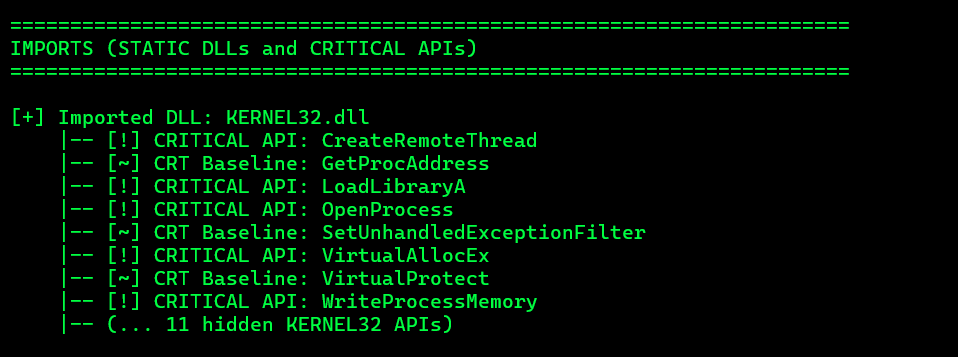
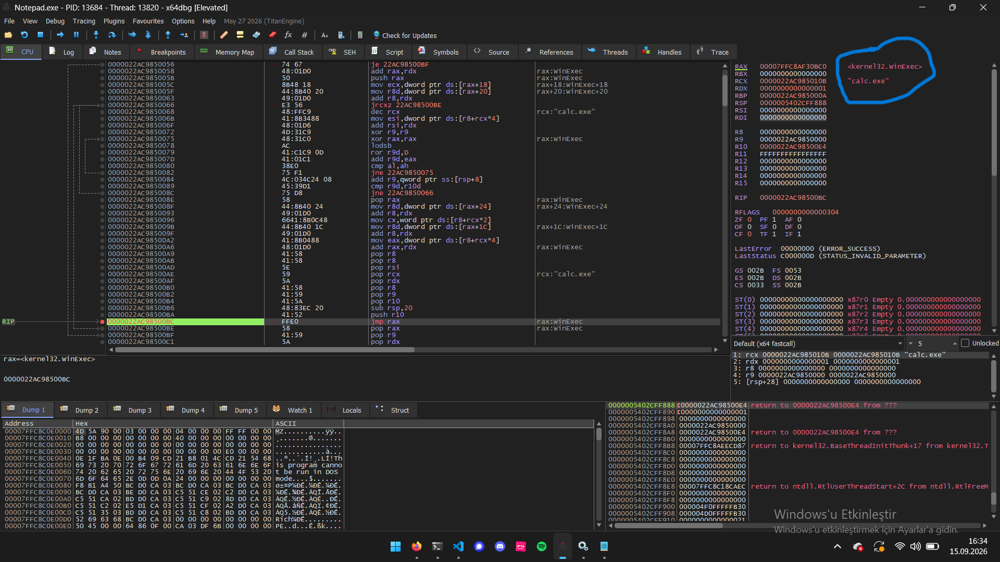
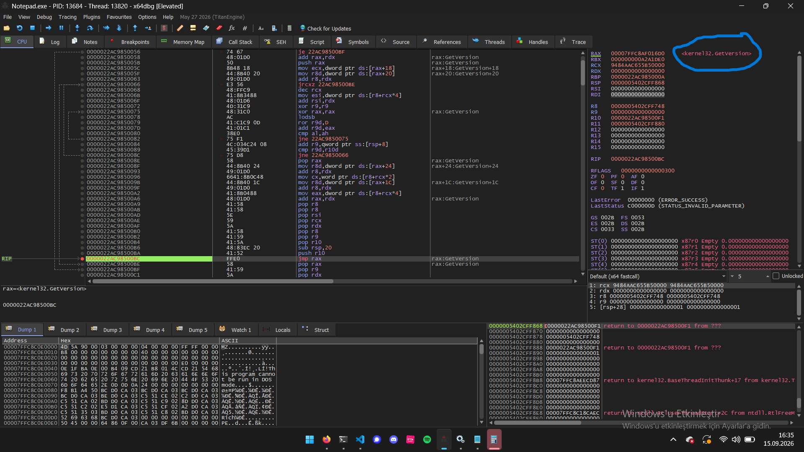
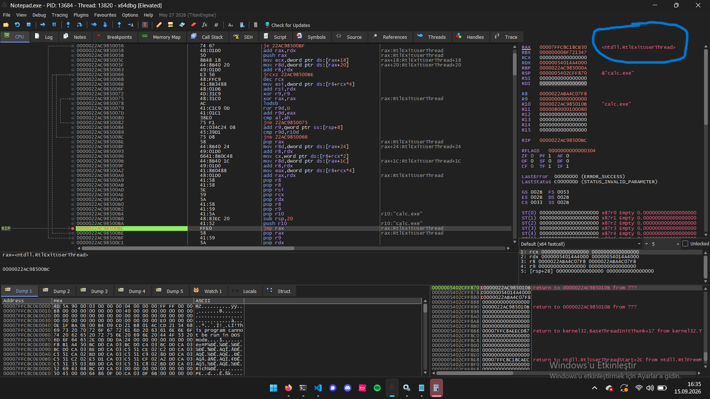
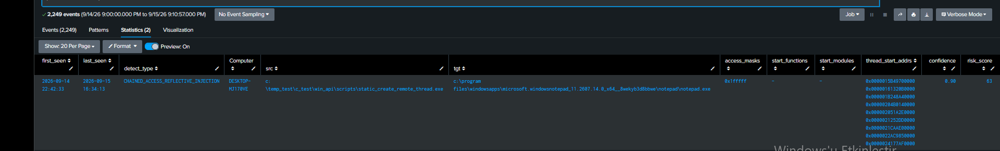

| Analysis Method | Static API (Classic) | Dynamic API (GetProcAddress) | API Hashing (Custom PEB/EAT) |
|---|---|---|---|
| Import Address Table (IAT) | `OpenProcess`, `WriteProcessMemory` are explicitly present. | `GetProcAddress`, `LoadLibraryA` are present. | NONE AT ALL! IAT is completely clean. |
| .rdata String Scan | Win32 API names present. | `"OpenProcess"`, `"VirtualAllocEx"` remain as plaintext. | Win32 API strings ZERO! Only 32-bit hex hashes (`0x7136FDD6`) remain. |
| Assembly Call Logic | `call ds:[<OpenProcess>]` | `call GetProcAddress("OpenProcess")` | `mov edx, 7136FDD6` → `call resolve_hash` |
| Debugger / Disassembler View | Debugger auto-labels the API name. | Debugger can see the API name/call. | Debugger CANNOT tell what is being looked up. Only sees a meaningless number. |

---

# Part 1: Static API Import Method Analysis (`static_create_remote_thread.c`)

### 1. Executive Summary & Lab Objectives
This phase analyzes the most basic variant of Process Injection: **Static WinAPI Import via IAT (Import Address Table)**. The target process is `notepad.exe`. Core functions (`OpenProcess`, `VirtualAllocEx`, `WriteProcessMemory`, and `CreateRemoteThread`) are invoked directly via standard C imports to execute a harmless 4-byte minimalist `NOP/RET` micro-shellcode (`0x90, 0x90, 0x90, 0xC3`).

The goal of this section is to document the artifacts left behind on the PE file structure, the Import Address Table (IAT) anomaly, the memory flow inside `x64dbg`, and the behavioral telemetry generated in Sysmon/Splunk.

---

### 2. Source Code & Execution Flow Architecture

[Static Create Remote Thread](../../scripts/static_create_remote_thread.c)

### 3. Static Binary Triage (pe-info-parser)

Static analysis of static_create_remote_thread.exe using a custom C-based PE parser (pe-info-parser) yields the following structural artifacts:
PE Header & Mitigation Indicators

    Architecture: x64 (AMD64)

    Subsystem: Windows Console (Subsystem 3)

    Image Base: 0x0000000140000000

    Mitigations: ASLR (ENABLED), DEP/NX (ENABLED), High Entropy VA (ENABLED)

Import Address Table (IAT) Artifacts

Inspection of the Import Directory (RVA: 0x0000A000) reveals that all critical API calls for process injection are explicitly exposed in plain text under KERNEL32.dll:




Forensic Note: Any pre-execution scan (AV/EDR/YARA) inspecting the IAT will immediately flag the combination of OpenProcess + VirtualAllocEx + WriteProcessMemory + CreateRemoteThread as a high-confidence indicator of MITRE ATT&CK T1055.002 (Process Injection).


### 4. Dynamic Memory & Debugger Behavior (x64dbg Analysis)

**4.1 Synchronized dual-instance debugging setup**

The injector binary (`static_create_remote_thread.exe`) prints the target PID and the `VirtualAllocEx`-returned base address to console, then pauses on `getchar()` *after* `WriteProcessMemory` completes but *before* `CreateRemoteThread` is triggered — a deliberate synchronization window built into the test harness for this exact purpose.

Procedure:
1. Run the injector, let it proceed through `OpenProcess → VirtualAllocEx → WriteProcessMemory`, and stop at the console pause.
2. Note the printed target PID and the allocated base address (e.g. `0x0000016132B0000A` region, code starting at `...B0000`).
3. Attach a second `x64dbg` instance to `notepad.exe` via **File → Attach**, selecting the printed PID.
4. In the notepad instance, go to the allocated address (`Ctrl+G`) and set a breakpoint (`F2`) on it.
5. Resume the notepad instance (`F9`) so it sits waiting for execution to reach that region.
6. Return to the injector console, press Enter — this fires `CreateRemoteThread`, which points `RIP` at the previously written shellcode inside `notepad.exe`.
7. The breakpoint in the notepad-attached instance fires immediately (`INT3 breakpoint at ...`), landing execution at the first shellcode instruction, ready for step-by-step analysis.

**4.2 Identifying the PEB-walk / hash-resolution stub**

Initial disassembly at the breakpoint showed no IAT-style `call qword ptr ds:[<...>]` pattern — instead:
```asm
xor rdx,rdx
mov rdx, gs:[rdx+60]      ; TEB -> PEB
mov rdx, ds:[rdx+18]      ; PEB -> Ldr
mov rdx, ds:[rdx+20]      ; -> InMemoryOrderModuleList
mov rsi, ds:[rdx+50]      ; -> BaseDllName
```
followed immediately by a `lodsb` / `ror r9d,0xD` / `add r9d,eax` / `loop` sequence. This pattern (TEB→PEB→Ldr chain plus a 13-bit rotate-and-add loop) was recognized as manual module enumeration combined with a ROR13 hash — the classic signature of shellcode that resolves its own imports instead of relying on a static IAT.

**4.3 Tracking the module-name hashing loop**

Stepping through the outer loop (`F8`/`F9` alternating with watching the `RSI` register, which x64dbg auto-annotates with the string it points to) confirmed the shellcode iterates the loaded-module list in order: `notepad.exe` first (from `InMemoryOrderModuleList`), then `ntdll.dll`, then `kernel32.dll`, observed via the `[rdx+50]` comment changing between breakpoint hits and the `RSI` register's inline string annotation (e.g. `rsi:"tepad.exe"`, later `rsi:"ntdll.dll"`).

**4.4 Locating the export-name comparison point**

Further down, the export directory is parsed manually (`e_lfanew` → `IMAGE_DIRECTORY_ENTRY_EXPORT` at NT-header offset `+0x88` → `AddressOfNames`/`NumberOfNames`), and each exported name is hashed with the same ROR13 loop, combined with the previously stored module hash (`add r9, qword ptr ss:[rsp+8]`), then compared:
```asm
cmp r9d, r10d
jne short <loop_start>
```
`R9D` holds the just-computed combined hash; `R10D` holds a caller-supplied target hash that never changes within the loop — the asymmetry between a loop-built register and a static one is the tell that this is the comparison of interest. On a genuine match, execution falls through to a tail call: `jmp rax` at offset `...00BC`, transferring control directly into the resolved API.

**4.5 Breakpoint strategy — iteration and correction**

Manually single-stepping through several thousand `ntdll`/`kernel32` exports was impractical, so conditional/logging breakpoints were attempted at the `cmp`/`jne` decision point before arriving at a reliable methodology:

- **Attempt 1 — condition on the `cmp` instruction itself (`...0089`), `Break Condition: zf==1`:** failed silently — breaking *on* the `cmp` address stops execution *before* the instruction executes, so `ZF` still reflects the *previous* instruction's result, not the comparison being tested.
- **Attempt 2 — condition moved to the `jne` instruction (`...008C`), `zf==1`:** returned `"Error when evaluating break condition"`, traced to leftover text in the **Command Condition** field (a separate field from Break Condition).
- **Attempt 3 — corrected token:** the correct register-flag token in this x64dbg build is prefixed with an underscore — `Break Condition: _zf==1` on `...008C`. This reliably paused execution only on genuine matches.
- **Attempt 4 — reading `RSI` at the `cmp`/`jne` point:** even with the corrected condition, reading `RSI` at this pause point proved unreliable for identifying the *true* resolved function. Because the loop scans thousands of candidate export names before reaching the true target, and because `RSI` reflects only the *currently tested candidate*, several breakpoint hits recorded plausible-looking but ultimately irrelevant names (`Wow64DisableWow64FsRedirection`, `GetVersionExA`, `RtlExpandEnvironmentStrings`) — later determined to be misattributions rather than genuine collisions (see 4.6).
- **Working methodology:** the resolver has a single, unambiguous exit point — `jmp rax` at `...00BC`. This address is only ever reached on a true hash match, so a plain (unconditional) breakpoint here, combined with reading `RAX` (which x64dbg auto-annotates with the resolved module and symbol name), gives a ground-truth result without any risk of misattributing an intermediate scan candidate.

**4.6 Live verification of all three resolved APIs**

The injector's `find_function` routine performs exactly three lookups per execution, corresponding to three `call rbp` sites in the resolver-caller code (offsets `...00E2`, `...00EF`, `...0109`). Setting a breakpoint on the resolver's `jmp rax` exit point (`...00BC`) and pressing `F9` three times in sequence captured each resolution independently and unambiguously:

| # | `RAX` at `jmp rax` | Resolved symbol | Supporting evidence |
|---|---|---|---|
| 1 | `00007FFC8AF30BC0` | **`kernel32.WinExec`** | `RCX` = pointer to `"calc.exe"` string (`WinExec`'s `lpCmdLine` argument) |
| 2 | `00007FFC8AF016D0` | **`kernel32.GetVersion`** | No arguments passed — consistent with `GetVersion()`'s zero-parameter signature |
| 3 | `00007FFC8C18CB30` | **`ntdll.RtlExitUserThread`** | Preceding version-check branch (`cmp al,6` / `jl` / `cmp bl,0xE0`) selected `0x6F721347` (`RtlExitUserThread` hash) over `0x0A2A1DE0` (`ExitThread`), confirming the lab OS reports a major version ≥ 6 via `GetVersion()` |

Shortly after the third resolution, thread-exit messages (`Thread <id> exit`) appeared in the debugger log, and a Calculator window (`calc.exe`) was observed to have launched — consistent with `WinExec("calc.exe", 1)` as the payload's actual behavior.







**4.7 Cross-reference against the published hash scheme**

The three hardcoded constants observed in the resolver-caller code (`R10D`/`EBX`: `0x876F8B31`, `0x9DBD95A6`, `0x0A2A1DE0`/`0x6F721347`) were cross-referenced against Metasploit's officially published `block_api` hash table (`rapid7/metasploit-framework`, `external/source/shellcode/windows/x86/src/hash.py`), which lists these exact values against `WinExec`, `GetVersion`, `ExitThread`, and `RtlExitUserThread` respectively — an independent, static confirmation of the live dynamic-analysis result in 4.6.

**Methodological note — root cause of the Section 4.5 misattributions:** the names recorded in the earlier `cmp`-point attempts were not hash collisions. `RSI` at a `cmp`/`jne` pause reflects whichever export name is *currently being tested* by the scanning loop, not necessarily the one that will be used — the hashing loop legitimately tests thousands of unrelated export names (in alphabetical/table order) before reaching the correct target, and pausing repeatedly at that shared decision point without discriminating *which* `call rbp` site triggered the current scan made it easy to log an irrelevant intermediate candidate as if it were the final answer.

**Corrected methodology for future analysis of this shellcode class:** do not trust register state sampled at comparison points inside a `find_function`-style scanning loop. Break on the resolver's single, unambiguous exit point (the tail-call instruction, `jmp rax`) instead. Every hit there corresponds to exactly one genuine resolution, eliminating both false positives and any need to reason about hash collisions during live debugging.

---

### 5. Sysmon/Splunk Behavioral Telemetry (Static Import Variant)

Despite the static, plain-text IAT exposing every critical API, runtime telemetry confirms the injection chain is still fully observable at the OS level — independent of how the APIs were resolved.

**Sysmon Event ID 10 (ProcessAccess):** The `OpenProcess(PROCESS_ALL_ACCESS, FALSE, targetPid)` call generates a `GrantedAccess=0x1fffff` event, `SourceImage=static_create_remote_thread.exe`, `TargetImage=notepad.exe`.

**Sysmon Event ID 8 (CreateRemoteThread):** The `CreateRemoteThread` call generates an event where `StartModule` and `StartFunction` are both empty (`-`), and `StartAddress` points into the previously allocated `PAGE_EXECUTE_READWRITE` region — confirming the thread entry point does not belong to any loaded module.

**Detection Query — Chained ProcessAccess + RemoteThread (2-stage correlation):**

```spl
index=windows_sysmon (EventCode=10 OR EventCode=8)
| eval src=lower(SourceImage), tgt=lower(TargetImage)
| eval is_cross = if(src!=tgt, 1, 0)
| where is_cross==1
| eval susp_access = if(EventCode=10 AND (GrantedAccess IN ("0x1f0fff","0x1fffff","0x1028","0x1428","0x0028","0x0020","0x147a")), 1, 0)
| eval is_kernel = if(EventCode=8 AND match(StartAddress,"(?i)^0xffff"), 1, 0)
| eval src_sys = if(match(src,"^c:\\\\windows\\\\system32\\\\"), 1, 0)
| eval sm_empty = if(EventCode=8 AND (StartModule=="-" OR StartModule=="" OR isnull(StartModule)), 1, 0)
| eval stage = case(
    EventCode=10 AND susp_access==1, "process_access",
    EventCode=8, "remote_thread",
    1=1, "other")
| where stage!="other"
| stats dc(stage) as distinct_stages, values(stage) as stages,
    min(_time) as first_seen, max(_time) as last_seen,
    max(susp_access) as has_susp_access, max(sm_empty) as has_unbacked_thread,
    max(is_kernel) as has_kernel_start, max(src_sys) as src_is_system32,
    values(GrantedAccess) as access_masks, values(StartFunction) as start_functions,
    values(StartModule) as start_modules, values(StartAddress) as thread_start_addrs
    by Computer, src, tgt
| where distinct_stages>=2 AND has_kernel_start==0
| eval sig_chained = if(has_susp_access==1 AND has_unbacked_thread==1, 1, 0)
| eval detect_type = case(
    sig_chained==1 AND src_is_system32==0, "CHAINED_ACCESS_REFLECTIVE_INJECTION",
    sig_chained==1 AND src_is_system32==1, "CHAINED_ACCESS_REFLECTIVE_INJECTION_SYS32SRC",
    distinct_stages>=2, "CHAINED_ACCESS_THREAD_GENERIC")
| eval confidence = case(
    sig_chained==1 AND src_is_system32==0, 0.90,
    sig_chained==1 AND src_is_system32==1, 0.65,
    1=1, 0.45)
| eval impact = 70
| eval risk_score = impact * confidence
| where risk_score >= 30
| table first_seen, last_seen, detect_type, Computer, src, tgt, access_masks, start_functions, start_modules, thread_start_addrs, confidence, risk_score
| fieldformat first_seen=strftime(first_seen, "%Y-%m-%d %H:%M:%S")
| fieldformat last_seen=strftime(last_seen, "%Y-%m-%d %H:%M:%S")
| sort - risk_score, - last_seen
```

**Result:**

| detect_type | src | tgt | access_masks | start_functions | start_modules | confidence | risk_score |
|---|---|---|---|---|---|---|---|
| CHAINED_ACCESS_REFLECTIVE_INJECTION | static_create_remote_thread.exe | notepad.exe | 0x1fffff | `-` | `-` | 0.90 | 63 |



The query flagged the source-target pair with the highest confidence tier available in the detection framework: a suspicious `PROCESS_ALL_ACCESS` grant followed by a remote thread whose start address resolves to no loaded module. This confirms the key finding of Part 1: **a fully static, IAT-visible injector is trivial to catch at the OS telemetry layer, independent of the fact that it is also trivial to catch statically** — the two detection layers (static PE/IAT analysis and dynamic behavioral telemetry) independently converge on the same verdict.

---

### 6. Conclusion

The static-import injection technique offers no meaningful evasion against either layer of defense. Static analysis (IAT inspection, PE parsing) immediately reveals the full injection primitive chain (`OpenProcess`, `VirtualAllocEx`, `WriteProcessMemory`, `CreateRemoteThread`) in plaintext under `kernel32.dll`. Dynamic behavioral telemetry (Sysmon EID 10 + EID 8 correlation) independently confirms the same activity through OS-level process-access and thread-creation events, entirely without relying on the IAT contents. This establishes the baseline case against which the more evasive variants (Dynamic API Resolution via `GetProcAddress`, and custom PEB-walk/hash-based resolution) are compared in subsequent sections — demonstrating that while static evasion improves progressively across the three variants, the underlying injection *mechanics* (unbacked-memory allocation, remote thread creation) remain equally detectable at the behavioral layer throughout.