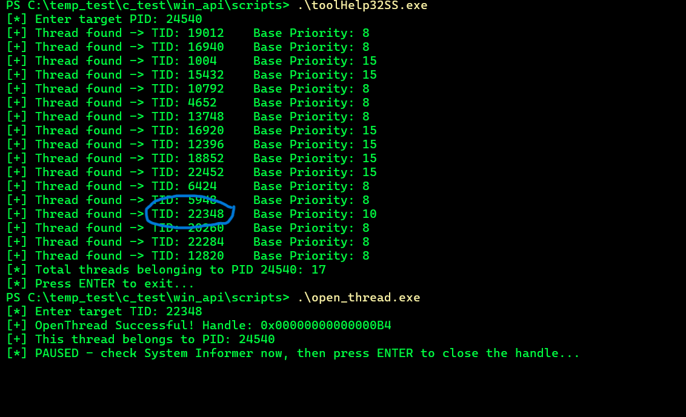
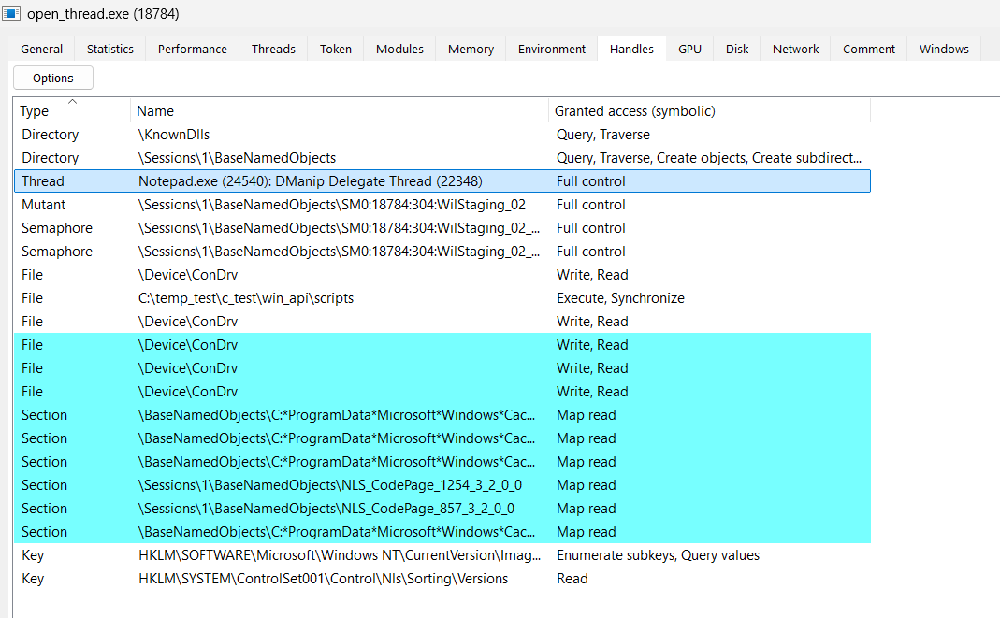

# 1. Thread ID vs Process ID

## What was tested

This lab tested the distinction between a process identifier (PID) and
a thread identifier (TID), and confirmed they are retrieved independently
of each other.

## C File

[Thread ID vs Process ID](../../scripts/thread_id.c)

Example output:

``` text
Thread ID (TID): 11156
Process Id (PID): 13204
```

## What was learned

A process and a thread are identified by **separate, independent numbers**.

``` c
DWORD tid = GetCurrentThreadId();
DWORD pid = GetCurrentProcessId();
```

Neither call reaches the kernel: both are read directly from the
**Thread Environment Block (TEB)** in user mode, making them essentially
free operations.

This distinction matters because thread-level APIs (`OpenThread()`, and
later `SetThreadContext()`/`QueueUserAPC()`) identify their target by
**TID**, not PID — a process-level habit (`OpenProcess(..., pid)`) does
not carry over to the thread API family.

---

# 2. Thread Pseudo-Handle

## What was tested

This lab tested `GetCurrentThread()` and compared its returned
pseudo-handle against the process-level pseudo-handle from
`GetCurrentProcess()`.

## C File

[Thread Pseudo-Handle](../../scripts/current_thread.c)

Example output:

``` text
[+] GetCurrentThread() pseudo-handle: 0xFFFFFFFFFFFFFFFE
[+] Real TID (for comparison): 23288
```

## What was learned

`GetCurrentThread()` does not open a real kernel handle — it returns a
**fixed pseudo-handle**, valid only within the calling thread's own
process context.

``` text
Process pseudo-handle (GetCurrentProcess): 0xFFFFFFFFFFFFFFFF   (-1)
Thread  pseudo-handle (GetCurrentThread):  0xFFFFFFFFFFFFFFFE   (-2)
```

Windows deliberately assigns different sentinel values (`-1` vs. `-2`)
so the two pseudo-handles can never be confused with one another.

This value cannot be used outside the process that created it — it would
need to be converted into a real handle via `DuplicateHandle()` first.
This limitation becomes relevant later, when examining thread-hijacking
techniques that require a genuine, transferable thread handle rather
than a pseudo-handle.

---

# 3. Enumerating a Process's Threads

## What was tested

This lab tested enumerating all threads belonging to a specific process
(notepad.exe) using a system-wide snapshot, filtered down by owner PID.

## C File

[Thread Enumeration](../../scripts/toolHelp32SS.c)

Example output:

``` text
[*] Enter target PID: 24540
[+] Thread found -> TID: 19012    Base Priority: 8
[+] Thread found -> TID: 16940    Base Priority: 8
[+] Thread found -> TID: 1004     Base Priority: 15
[+] Thread found -> TID: 15432    Base Priority: 15
[+] Thread found -> TID: 10792    Base Priority: 8
[+] Thread found -> TID: 4652     Base Priority: 8
[+] Thread found -> TID: 13748    Base Priority: 8
[+] Thread found -> TID: 16920    Base Priority: 15
[+] Thread found -> TID: 12396    Base Priority: 15
[+] Thread found -> TID: 18852    Base Priority: 15
[+] Thread found -> TID: 22452    Base Priority: 15
[+] Thread found -> TID: 6424     Base Priority: 8
[+] Thread found -> TID: 5948     Base Priority: 8
[+] Thread found -> TID: 22348    Base Priority: 10
[+] Thread found -> TID: 20260    Base Priority: 8
[+] Thread found -> TID: 5576     Base Priority: 8
[+] Thread found -> TID: 24496    Base Priority: 8
[+] Thread found -> TID: 12628    Base Priority: 8
[+] Thread found -> TID: 21424    Base Priority: 8
[*] Total threads belonging to PID 24540: 19
```

## What was learned

Unlike process-level APIs, `CreateToolhelp32Snapshot()` does not accept
a target PID directly:

``` c
CreateToolhelp32Snapshot(TH32CS_SNAPTHREAD, 0);
```

The snapshot captures **every thread on the system**, across all
processes, in one call. Filtering down to a single process is done
manually by comparing `th32OwnerProcessID` against the target PID while
walking the list with `Thread32First()`/`Thread32Next()`.

A modern `notepad.exe` returned **19 threads**, not one — a reminder that
even a simple-looking application is no longer single-threaded on current
Windows versions (notepad.exe is now a packaged, XAML-based app with
background threads for rendering, input handling, and other subsystems).

`Base Priority` values also varied (8, 10, 15) across threads within the
same process — a single process does not run all of its threads at the
same scheduling priority; UI-responsiveness-critical threads are commonly
elevated relative to background worker threads.

This enumeration step is the prerequisite for the next test: picking one
of these TIDs and opening a real, non-pseudo handle to it via
`OpenThread()`.

---

# 4. Opening a Real Thread Handle

## What was tested

This lab tested opening a genuine (non-pseudo) handle to a specific
thread using its TID, verifying the handle's owning process from within
the code, and then cross-verifying the handle externally using System
Informer while it was still held open.

## C File

[Open Thread](../../scripts/open_thread.c)

Example output:

``` text
[*] Enter target TID: 22348
[+] OpenThread Successful! Handle: 0x00000000000000B8
[+] This thread belongs to PID: 24540
[*] PAUSED - check System Informer now, then press ENTER to close the handle...
```



## What was learned

``` c
HANDLE hThread = OpenThread(THREAD_ALL_ACCESS, FALSE, targetTid);
```

Unlike the pseudo-handles from Tests 1–2, this is a **real kernel
object handle** — it must eventually be closed with `CloseHandle()`,
and it can, if duplicated via `DuplicateHandle()`, be shared with
another process.

`GetProcessIdOfThread(hThread)` closes the loop in the other direction:
given only a thread handle, the owning process can be recovered,
confirming the handle genuinely points at a thread belonging to the
expected PID (`24540`).

A secondary observation from re-running the Test 3 enumeration moments
apart: the thread count dropped from 19 to 17 between two snapshots a
few seconds apart, confirming that individual threads within a process
are transient — a TID captured in one snapshot is not guaranteed to
still exist by the time it is acted on, and production tooling
targeting a specific thread should handle a stale-TID failure
(`OpenThread` returning `NULL`, `GetLastError() == ERROR_INVALID_PARAMETER`)
as an expected condition, not an anomaly.

## System Informer Cross-Verification

A handle is not the object itself — it is a reference stored in the
**calling process's own handle table**. The thread being referenced
belongs to, and is accounted against, the target process; the handle
bookkeeping lives entirely in whichever process opened it. To confirm
this concretely, the program was modified to pause (via `getchar()`)
*before* calling `CloseHandle()`, so the handle could be inspected live
in System Informer.

Inspecting `open_thread.exe`'s own Handles tab (filtered by Type) while
the handle was still open showed:

``` text
Thread, Notepad.exe (24540): DManip Delegate Thread (22348), Full control
```



This confirms the handle is listed under the **caller's** process
(`open_thread.exe`), not the target's — the entry names the target
process and thread (`Notepad.exe (24540)`, TID `22348`), and the
`Full control` access matches the requested `THREAD_ALL_ACCESS`, granted
here without restriction (same-user, non-elevated target — access can
be narrowed by the OS for protected or elevated targets, not observed
in this case).

System Informer additionally resolved the thread's Windows-internal
role — "DManip Delegate Thread", a DirectManipulation/DWM background
thread unrelated to Notepad's main UI logic — illustrating that thread
enumeration surfaces arbitrary internal threads, not just
security-relevant ones. A real attacker selecting an injection target
would typically prefer an inconspicuous background thread like this one
over the main message-pump thread, to reduce the chance of visibly
disrupting the target application.

---

