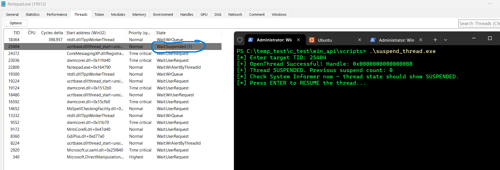
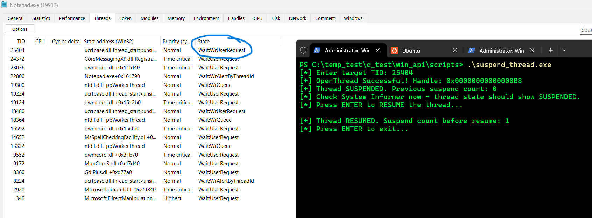

# Suspending and Resuming a Thread

## What was tested

This lab tested suspending a specific thread (freezing its execution)
and resuming it, using a minimal access mask rather than
`THREAD_ALL_ACCESS`, then verified the suspended state externally in
System Informer.

## C File

[Suspend Thread](../../scripts/suspend_thread.c)

Example output:

``` text
[*] Enter target TID: 25404
[+] OpenThread Successful! Handle: 0x00000000000000B8
[+] Thread SUSPENDED. Previous suspend count: 0
[*] Check System Informer now - thread state should show SUSPENDED.
[*] Press ENTER to RESUME the thread...
```

## What was learned

``` c
HANDLE hThread = OpenThread(THREAD_SUSPEND_RESUME, FALSE, targetTid);
DWORD suspendCount = SuspendThread(hThread);
...
DWORD resumeCount = ResumeThread(hThread);
```

Only `THREAD_SUSPEND_RESUME` was requested here, not `THREAD_ALL_ACCESS`
— the access mask was narrowed to exactly what the operation needs,
reinforcing the earlier access-mask lesson from process handles: a
handle's granted rights, not its mere existence, define what it can
actually do.

`SuspendThread()`/`ResumeThread()` do not return a boolean — they
return the thread's **previous suspend count**, a nesting counter
rather than a flag. A thread only actually resumes execution once its
suspend count reaches zero; calling `SuspendThread()` twice requires
two matching `ResumeThread()` calls, a common source of bugs in
thread-hijacking code that assumes a single suspend/resume pair.

## System Informer Cross-Verification

Adding the **State** column to Notepad's Threads tab, while the handle
was held open (paused before `ResumeThread`), showed:

``` text
TID: 25404    State: Wait:Suspended (1)
```





Every other thread in the process showed a normal wait state
(`Wait:UserRequest`, `Wait:WrQueue`, etc.) — only the targeted thread
was suspended, and the `(1)` matches the suspend count reported by the
program's own output, externally confirming both that the correct
thread was frozen and that the suspend-count accounting is accurate.

This is the mechanical first step of thread hijacking: a target thread
must be suspended before its register state (`CONTEXT`, Test 6) can be
safely read or rewritten — modifying an actively-running thread's
registers is a race condition.

---

