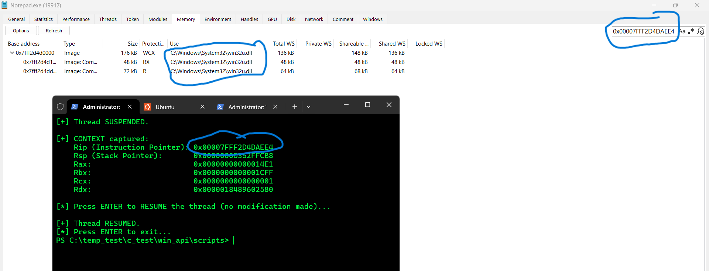

# 6. Reading Thread Context (GetThreadContext)

## What was tested

This lab tested capturing a suspended thread's full register state
(`CONTEXT` structure), including its instruction pointer, without
modifying anything.

## C File

[Get Thread Context](../../scripts/getThreadContext.c)

Example output:

``` text
[+] CONTEXT captured:
    Rip (Instruction Pointer): 0x00007FFF2D4DAEE4
    Rsp (Stack Pointer):       0x0000000D352FFCB8
    Rax:                       0x00000000000014E1
    Rbx:                       0x0000000000001CFF
    Rcx:                       0x0000000000000001
    Rdx:                       0x0000018489602580
```

## What was learned

``` c
CONTEXT ctx;
ctx.ContextFlags = CONTEXT_FULL;
GetThreadContext(hThread, &ctx);
```

The `CONTEXT` structure is a large struct covering multiple register
groups (integer, control, segment, floating-point, debug). The caller
must set `ContextFlags` **before** calling `GetThreadContext()` to
specify which subset is needed — an unset or wrong flag produces
undefined/incomplete results rather than an error in some cases, making
this a silent failure mode worth remembering.

The thread must be suspended first (Test 5) — reading the context of a
running thread is meaningless, since the register values would already
be stale by the time they're read.

`Rip` is the most security-relevant field captured here: it is the
**exact instruction address** the thread will resume at once execution
continues. This is precisely the field a thread-hijacking technique
overwrites (Test 7, `SetThreadContext`) to redirect a thread into
attacker-controlled code — everything up to this point (suspend, read
context) is reconnaissance; overwriting `Rip` is the actual hijack.

The captured `Rip` (`0x00007FFF2D4DAEE4`) falls inside a system DLL's
address range rather than Notepad's own code — consistent with the
thread being parked in a wait state (as observed via System Informer's
`Wait:*` state column in Test 5) at the moment it was suspended, rather
than mid-execution of application logic.

## Rip Address Resolution (System Informer, Memory tab)

Looking up `0x00007FFF2D4DAEE4` in Notepad's memory map showed:

``` text
0x7FFF2D4D0000   Image           176 KB   WCX   win32u.dll
0x7FFF2D4D1000   Image: Commit    48 KB   RX    win32u.dll
0x7FFF2D4DD000   Image: Commit    72 KB   R     win32u.dll
```



The captured `Rip` falls inside `win32u.dll`'s executable (`RX`) region
-- the user-mode interface layer that turns GDI/USER API calls into
`win32k.sys` kernel syscalls. This is consistent with the thread having
been suspended mid-wait inside its message loop (matching the
`Wait:UserRequest` state observed in Test 5/System Informer): the
thread was parked waiting on a window message, not actively executing
Notepad's own application code, at the moment it was frozen.

