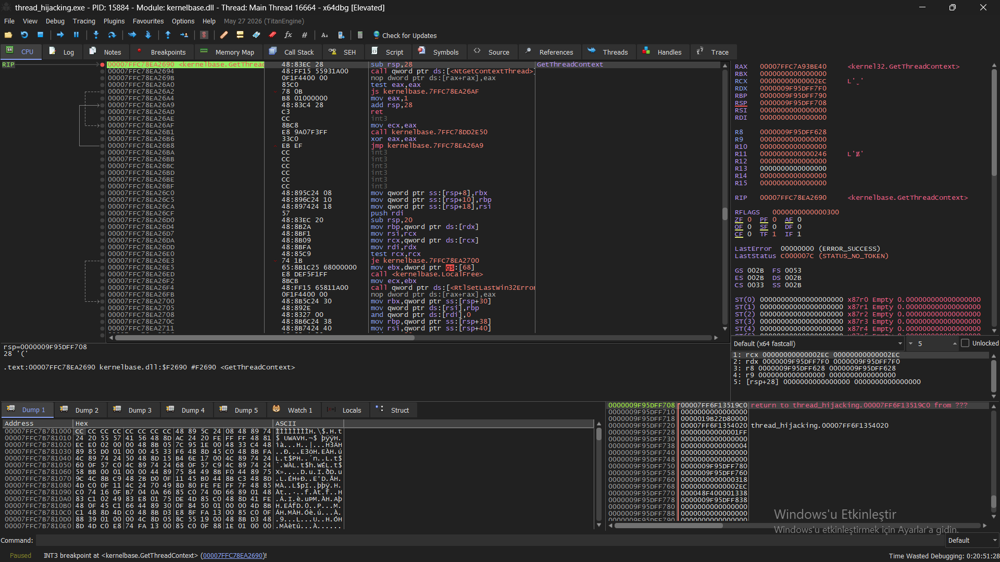
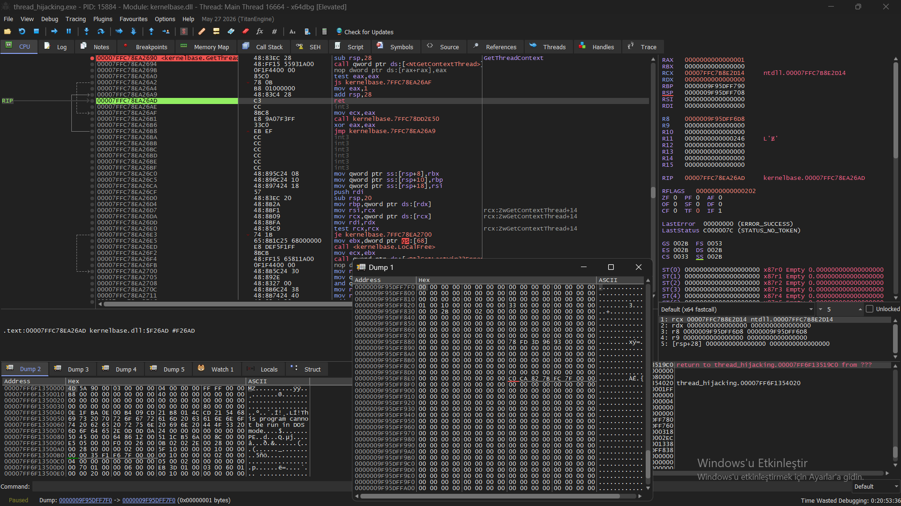
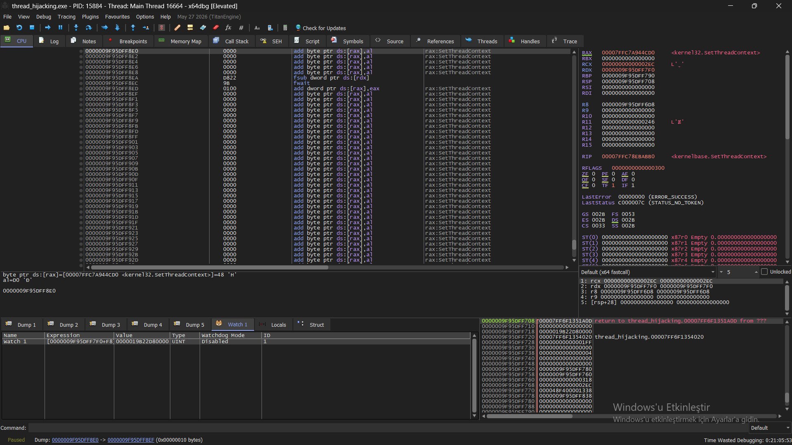
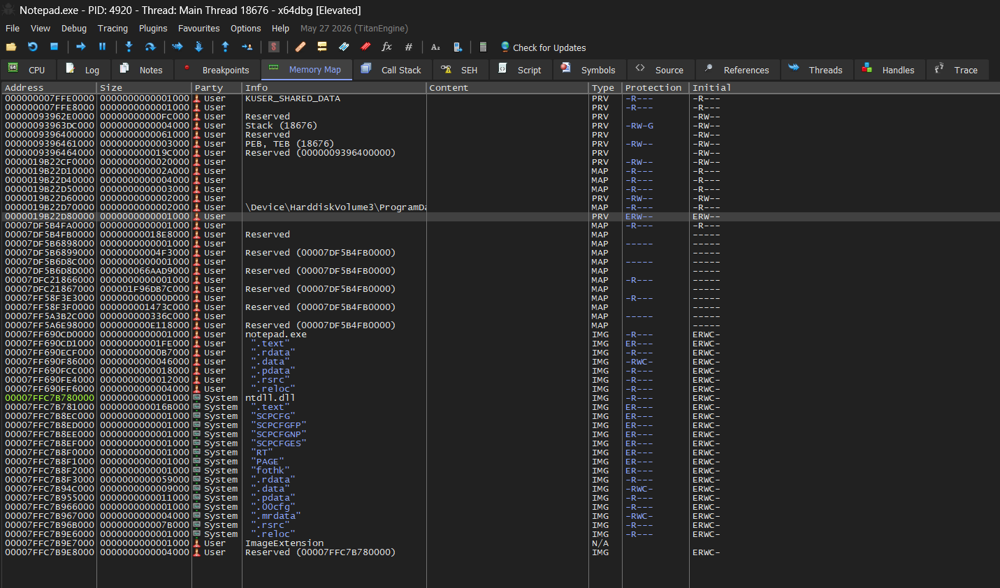

# Thread Hijacking via SetThreadContext — CONTEXT Structure Analysis

**Target process:** `notepad.exe`
**Injector:** `thread_hijacking.exe`
**Tool:** x64dbg (dual-instance dynamic analysis)
**Technique:** Suspend → Get/Modify CONTEXT → Set → Resume (classic thread hijacking)

---

## 1. Objective

Verify — at the register/memory level, not just by observed behavior ("a shell popped") — exactly how `thread_hijacking.exe` redirects execution in a remote thread belonging to `notepad.exe` via the `SetThreadContext` API. Specifically: confirm the `Rip` field before and after the hijack, and confirm the destination address is attacker-controlled shellcode rather than a legitimate code path.

## 2. Methodology

1. Attached x64dbg to `thread_hijacking.exe`, set a breakpoint on `kernelbase.dll!GetThreadContext` (the real implementation — `kernel32.dll`'s export is just a forwarder thunk: `jmp qword ptr ds:[<GetThreadContext>]`).
2. On hit, captured the `CONTEXT*` pointer from `RDX` (2nd argument, x64 fastcall convention).
3. Ran to the function's `ret` (`Ctrl+F9`) so the CONTEXT buffer would be populated.
4. Located `Rip` at `CONTEXT` base + `0xF8` and read the pre-hijack value directly from the CONTEXT buffer (verified via Watch expression, not manual hex counting, to eliminate offset-counting errors).
5. Repeated the same procedure at `kernelbase.dll!SetThreadContext`, reading the *same* buffer address (`RDX` was identical across both calls — confirming the code round-trips the same CONTEXT struct rather than allocating a new one) to capture the post-modification `Rip`.
6. Attached a **second, independent x64dbg instance** to `notepad.exe` itself and queried its Memory Map for the post-hijack `Rip` address, to determine what kind of memory region execution was being redirected into.

## 3. Findings

### 3.1 CONTEXT buffer

| Property | Value |
|---|---|
| Buffer address (shared across `GetThreadContext`/`SetThreadContext`) | `0x0000009F95DFF7F0` |
| `ContextFlags` (offset `0x30`) | `0x00100001` → `CONTEXT_CONTROL` only |

`CONTEXT_CONTROL` guarantees only `SegCs`, `SegSs`, `Rsp`, `Rip`, `EFlags` — consistent with a minimal hijack that only needs to redirect the instruction pointer, not the full register set.


*Breakpoint on `kernelbase.dll!GetThreadContext`. `RDX = 0x0000009F95DFF7F0` — the CONTEXT buffer address used throughout this analysis.*


*Raw dump of the CONTEXT buffer after `GetThreadContext` returns. Offset `0x30` = `01 00 10 00` (`CONTEXT_CONTROL`); offset `0xF8` (Rip) = `C0 CA 82 7B FC 7F 00 00` → `0x00007FFC7B82CAC0`.*

### 3.2 Rip before/after

| Stage | `Rip` value | Interpretation |
|---|---|---|
| Pre-hijack (post-`GetThreadContext`) | `0x00007FFC7B82CAC0` | High system-DLL address range — the thread's legitimate suspended position (`ntdll`/`kernelbase` region) |
| Post-hijack (pre-`SetThreadContext`) | `0x0000019B22D80000` | Address in a completely different range — not part of any loaded module |


*Watch expression `[buffer+0xF8]` evaluated at the `SetThreadContext` breakpoint (same buffer, `RDX` unchanged): `Rip = 0x0000019B22D80000`.*

### 3.3 Destination region (queried from a second x64dbg instance attached to `notepad.exe`)

| Field | Value |
|---|---|
| Address | `0000019B22D80000` |
| Size | `0x1000` |
| Allocation Type | `PRV` (`MEM_PRIVATE`) |
| Allocation Protection | `ERW-` |
| Current Protection | `ERW-` |

`MEM_PRIVATE` + simultaneous **execute + write** protection is not something legitimate code paths produce (W^X violation) — it is the standard signature of a `VirtualAllocEx`-style shellcode staging buffer.


*Second x64dbg instance attached directly to `notepad.exe`. Region `0000019B22D80000`: Type `PRV`, Protection `ERW--` (execute + write, `MEM_PRIVATE`) — highlighted row.*

## 4. Conclusion

The captured evidence confirms the full hijack chain end-to-end:

```
SuspendThread(hThread)
  → GetThreadContext(hThread, &ctx)      // ctx.Rip = 0x00007FFC7B82CAC0 (legit, in ntdll/kernelbase)
  → ctx.Rip = <shellcode address>        // modified in-process, same CONTEXT buffer
  → SetThreadContext(hThread, &ctx)      // ctx.Rip = 0x0000019B22D80000 (PRV, ERW-)
  → ResumeThread(hThread)                // execution now starts at attacker buffer
```

The instruction pointer was redirected from a legitimate suspended position inside a system DLL to a private, execute+write-mapped region inside the target process — the defining characteristic of thread-hijacking-based code injection.

## 5. Detection notes

- `SetThreadContext` itself produces no dedicated Sysmon event ID — it is not directly observable via Sysmon out of the box.
- The observable telemetry gap is closed by correlating the *consequences*: a thread resuming execution with a start address inside a `MEM_PRIVATE` region carrying `PAGE_EXECUTE_READWRITE` protection is the detectable artifact, typically surfaced via:
  - EDR "unbacked execution" / "suspicious thread start address" heuristics
  - Manual/Sysmon-based correlation of `ProcessAccess` (EID 10, with `PROCESS_SUSPEND_RESUME | PROCESS_SET_CONTEXT` access rights) against the target thread, combined with subsequent execution from non-image memory
- This differs from the `CreateRemoteThread` + `WriteProcessMemory` pattern already covered in Part 1 of the injection API resolution report — no new thread is created, no `EID 8` fires; the existing thread's control flow is what changes, which is precisely why it evades detections tuned only for `CreateRemoteThread`.

## 6. Artifacts / evidence

- CONTEXT buffer address and `ContextFlags`: captured via raw dump and Watch expression `[buffer+0x30]`
- Pre/post `Rip`: captured via raw dump (pre) and Watch expression `[buffer+0xF8]` (post) at both API breakpoints
- Destination region protections: captured via Memory Map, second x64dbg instance attached directly to `notepad.exe`
