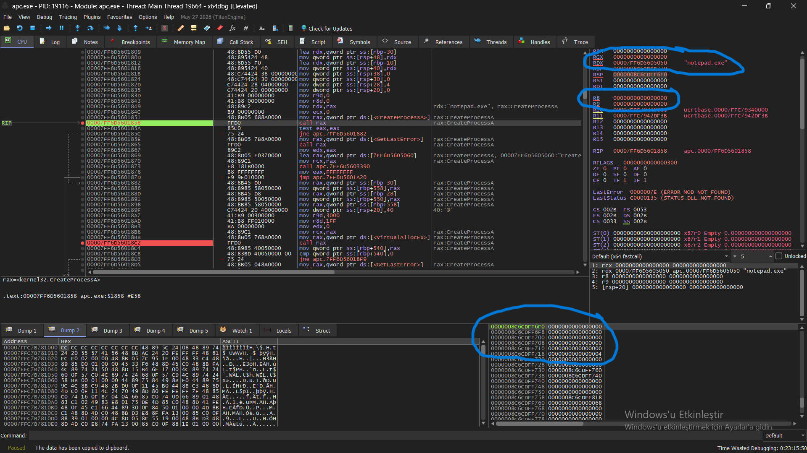
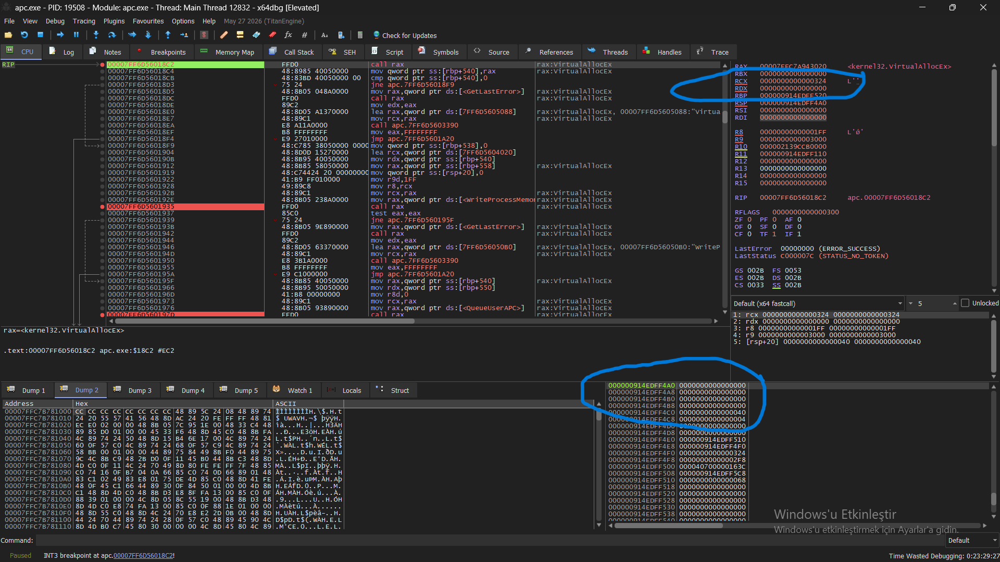
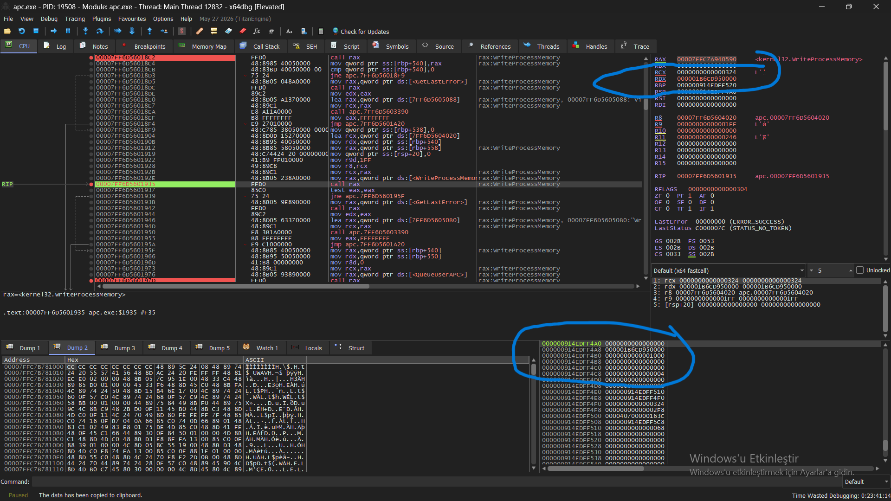
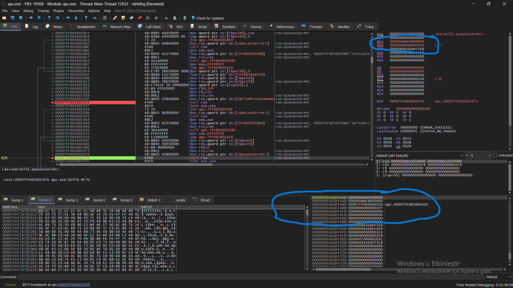
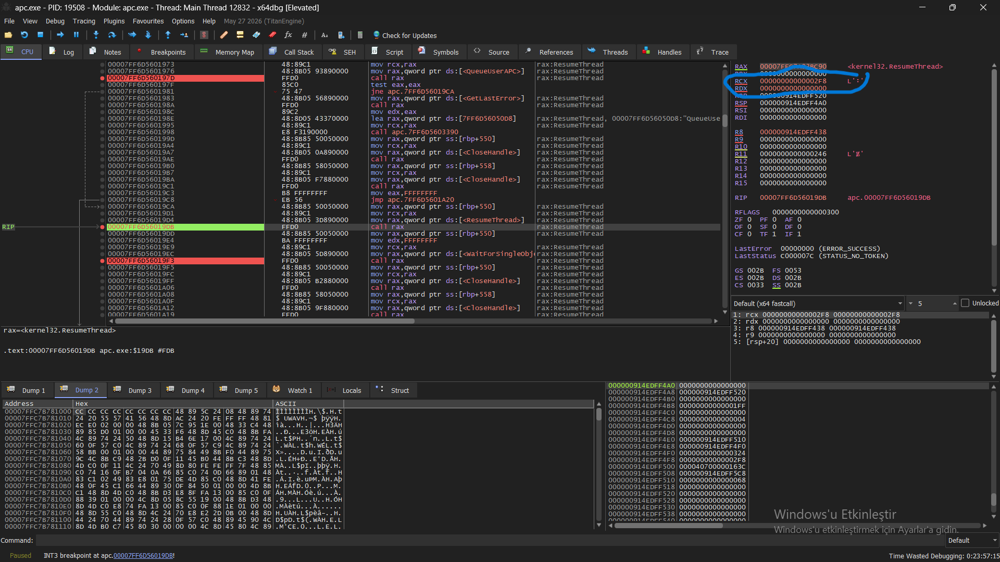
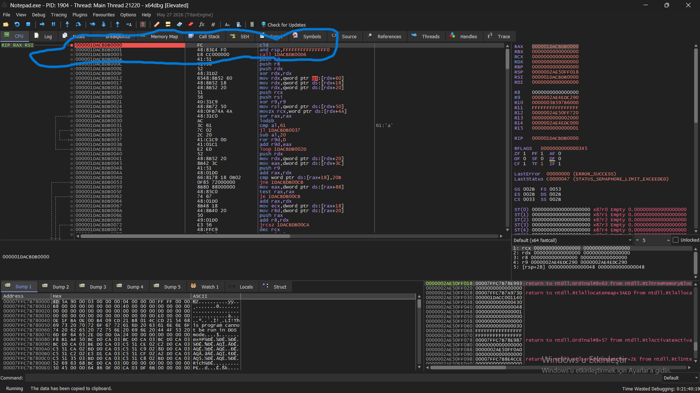

# APC-Based Process Injection — Dynamic Analysis Report

## 1. Objective

The objective of this lab was to dynamically analyze an APC-based process injection technique on Windows and verify the execution flow at both the Win32 API and x64 assembly levels.

The analysis focused on the following stages:

1. Creating a suspended target process.
2. Allocating memory inside the target process.
3. Writing a payload into the allocated memory.
4. Queuing the payload as a user-mode APC.
5. Resuming the suspended target thread.
6. Verifying that execution eventually reached the injected memory region.

The analysis was performed using x64dbg against both the injector process and the target `notepad.exe` process.

---

## 2. Target Process Creation

The injector first creates `notepad.exe` using `CreateProcessA`.

The process is created with the `CREATE_SUSPENDED` flag, causing the initial thread of the target process to remain suspended.

The x64 Windows calling convention was also verified during debugging.

The first four parameters were passed through registers:

| Parameter             | Location | Observed value  |
| --------------------- | -------- | --------------- |
| `lpApplicationName`   | RCX      | `NULL`          |
| `lpCommandLine`       | RDX      | `"notepad.exe"` |
| `lpProcessAttributes` | R8       | `NULL`          |
| `lpThreadAttributes`  | R9       | `NULL`          |

The remaining parameters were passed on the stack according to the Windows x64 calling convention.

In particular:

* `[RSP+20]` = `FALSE`
* `[RSP+28]` = `CREATE_SUSPENDED`
* `[RSP+30]` = `NULL`
* `[RSP+38]` = `NULL`
* `[RSP+40]` = `&STARTUPINFO`
* `[RSP+48]` = `&PROCESS_INFORMATION`

This confirmed that the target process was intentionally created in a suspended state.



---

## 3. Remote Memory Allocation

After obtaining a handle to the target process, the injector calls `VirtualAllocEx`.

The observed parameters were:

| Parameter          | Register/Stack | Value                 |
| ------------------ | -------------- | --------------------- |
| `hProcess`         | RCX            | Target process handle |
| `lpAddress`        | RDX            | `NULL`                |
| `dwSize`           | R8             | `0x1FF`               |
| `flAllocationType` | R9             | `0x3000`              |
| `flProtect`        | `[RSP+20]`     | `0x40`                |

`0x3000` represents:

```text
MEM_COMMIT | MEM_RESERVE
```

and `0x40` corresponds to:

```text
PAGE_EXECUTE_READWRITE
```

The return value provided an address in the target process's virtual address space.

This address was subsequently used as the destination for the payload.




---

## 4. Writing the Payload

The injector then calls `WriteProcessMemory`.

The observed parameters were:

| Parameter                | Register/Stack | Value                    |
| ------------------------ | -------------- | ------------------------ |
| `hProcess`               | RCX            | Target process handle    |
| `lpBaseAddress`          | RDX            | Remote allocated address |
| `lpBuffer`               | R8             | Local payload address    |
| `nSize`                  | R9             | `0x1FF`                  |
| `lpNumberOfBytesWritten` | `[RSP+20]`     | `NULL`                   |

The payload was therefore copied from the injector's address space into the previously allocated memory inside `notepad.exe`.

The remote address returned by `VirtualAllocEx` and subsequently passed to `WriteProcessMemory` was also observed during debugging.




---

## 5. Queueing the APC

The next stage was the call to `QueueUserAPC`.

The relevant parameters were:

| Parameter | Register | Value                  |
| --------- | -------- | ---------------------- |
| `pfnAPC`  | RCX      | Remote payload address |
| `hThread` | RDX      | Target thread handle   |
| `dwData`  | R8       | `0`                    |

The important observation here is that the first parameter, `pfnAPC`, contained the address of the previously allocated and populated remote memory region.

Conceptually:

```text
VirtualAllocEx
       ↓
Remote memory address
       ↓
WriteProcessMemory
       ↓
Payload stored at remote address
       ↓
QueueUserAPC(remote address, target thread, 0)
```


This established that the injected memory region was being used as the APC routine address.



---

## 6. Resuming the Target Thread

The target thread was initially suspended, so the injector subsequently called `ResumeThread`.

The only parameter was passed through RCX:

```text
RCX = target thread handle
```

The relevant execution sequence in the injector was:

```asm
call QueueUserAPC
...
call ResumeThread
...
call WaitForSingleObject
```

This demonstrated the transition from the suspended target state toward execution.



---

## 7. Verifying APC Execution

To verify whether execution actually reached the injected payload, a second x64dbg instance was attached to `notepad.exe`.

A breakpoint was placed at the remote payload address.


The debugger subsequently stopped with:

```text
RIP = 000001DACBDB0000
```




The memory at this address contained:

```asm
000001DACBDB0000    FC              cld
000001DACBDB0001    48 83 E4 F0    and rsp, FFFFFFFFFFFFFFF0
000001DACBDB0005    E8 CC000000    call ...
```


This is the most significant observation of the experiment.

The instruction pointer of the target process reached the exact address where the injected payload had previously been written.

Therefore, the analysis confirmed not only that the APC was queued, but that execution reached the injected memory region.

---

## 8. Payload Entry Analysis

The first instructions of the payload were also inspected.

The payload begins with:

```asm
cld
and rsp, 0xFFFFFFFFFFFFFFF0
call ...
push r9
push r8
push rdx
xor rdx, rdx
mov rdx, gs:[rdx+0x60]
```

The initial instructions demonstrate several relevant x64 concepts.

### Stack Alignment

```asm
and rsp, 0xFFFFFFFFFFFFFFF0
```

aligns the stack pointer to a 16-byte boundary.

This is relevant to the Windows x64 ABI and to subsequent function calls.

### Register Preservation

The payload pushes several registers onto the stack before continuing:

```asm
push r9
push r8
push rdx
...
push rcx
push rsi
```

This indicates that the payload is preserving execution state before performing its internal operations.

### PEB Access

The sequence:

```asm
xor rdx, rdx
mov rdx, gs:[rdx+0x60]
```

uses the x64 Windows GS segment to access the current process environment and is consistent with obtaining the Process Environment Block (PEB).

The following instructions continue into module/PE parsing logic.

### API Hashing

The payload also contains the characteristic sequence:

```asm
ror r9d, 0xD
add r9d, eax
```

which is consistent with a ROR13-style hashing loop used by many shellcode implementations for resolving API names without directly storing their textual names.


The purpose of this section was not to fully reverse engineer the payload, but to establish that the bytes reached by the APC corresponded to executable payload code rather than an unrelated memory region.

---

## 9. Complete Observed Execution Chain

The complete execution flow observed during the experiment can be summarized as follows:

```text
CreateProcessA
      │
      │ CREATE_SUSPENDED
      ▼
Suspended notepad.exe
      │
      ▼
VirtualAllocEx
      │
      │ Allocate remote memory
      ▼
Remote memory address
      │
      ▼
WriteProcessMemory
      │
      │ Copy payload
      ▼
Payload in target process
      │
      ▼
QueueUserAPC
      │
      │ pfnAPC = remote payload address
      ▼
APC queued for target thread
      │
      ▼
ResumeThread
      │
      ▼
APC dispatch
      │
      ▼
RIP = remote payload address
      │
      ▼
Injected payload begins execution
```


---

## 10. Findings

The dynamic analysis established the following:

* `notepad.exe` was created in a suspended state.
* Memory was allocated inside the target process.
* The payload was written into that remote memory.
* The remote payload address was passed to `QueueUserAPC` as the APC routine.
* The target thread was subsequently resumed.
* A debugger attached to the target process observed `RIP` reaching the remote payload address.
* The first instructions at that address were valid executable x64 instructions.
* The payload contained recognizable PEB traversal, PE parsing, and ROR13-style API hashing patterns.

The critical proof point was the following observation:

```text
RIP = 000001DACBDB0000
```

while the same address contained:

```asm
000001DACBDB0000    FC    cld
```

This directly correlated the target thread's instruction pointer with the memory region populated by the injector.

---

## 11. Conclusion

The experiment successfully demonstrated the execution flow of an APC-based process injection technique at the Win32 API and x64 instruction levels.

The analysis progressed from high-level API calls:

```text
CreateProcessA
VirtualAllocEx
WriteProcessMemory
QueueUserAPC
ResumeThread
```

down to the target process's instruction pointer.

The most significant result was observing the target thread enter the injected memory region:

```text
RIP → injected payload
```

This provided dynamic evidence that the APC-based control-flow transfer reached the injected payload address.

The analysis therefore successfully validated the intended injection chain at runtime.

The payload itself was not fully reverse engineered instruction-by-instruction; the analysis instead focused on establishing the injection flow and verifying execution at the payload entry point.
