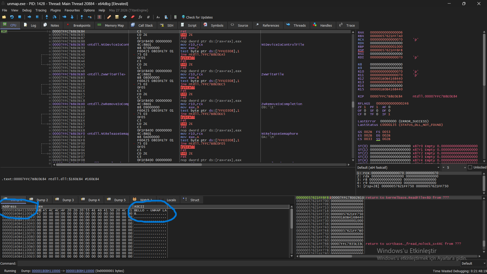
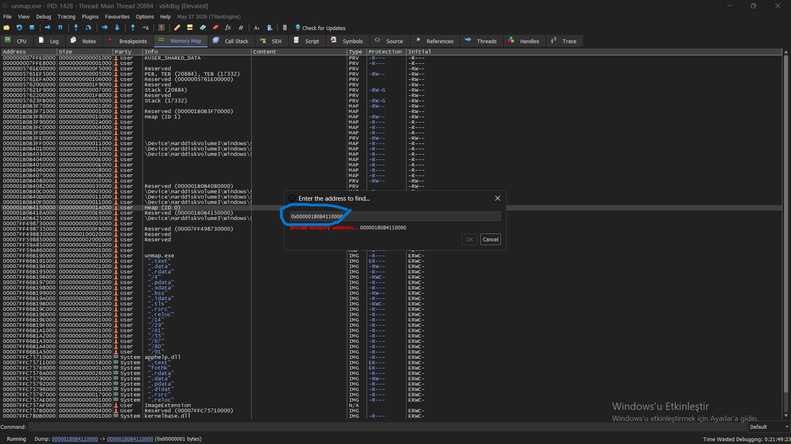

# NtUnmapViewOfSection — Memory Unmapping Lab

## Objective

The objective of this lab was to understand how `NtUnmapViewOfSection` removes a previously mapped memory view from a process's virtual address space.

The lab was designed as a continuation of the previous `CreateFileMapping` / `MapViewOfFile` shared-memory experiment.

---

## API

### NtUnmapViewOfSection

`NtUnmapViewOfSection` is a Windows Native API exported by `ntdll.dll`.

Its purpose is to remove a mapped view of a section from a specified process's virtual address space.

The API receives two important parameters:

```text
ProcessHandle
BaseAddress
```

In this lab:

```c
NtUnmapViewOfSection(
    GetCurrentProcess(),
    (PVOID)pBuf
);
```

`GetCurrentProcess()` identifies the current process, while `pBuf` contains the base address returned by `MapViewOfFile`.

Conceptually:

```text
MapViewOfFile
      ↓
Section mapped into process
      ↓
Virtual address obtained
      ↓
NtUnmapViewOfSection
      ↓
Mapped view removed
```

---

## Test Scenario

[NtUnmapViewOfSection.c](../../scripts/unmap.c)

The program first created a named section object using:

```c
CreateFileMappingA(...)
```

The section was then mapped into the process with:

```c
MapViewOfFile(...)
```

The returned address was:

```text
0x000001B0B4110000
```

A test string was written to this mapped region:

```text
HELLO - UNMAP LAB
```

Before calling `NtUnmapViewOfSection`, the address was inspected using x64dbg. The mapped region was visible in the Memory Map, and the written string could be observed at the corresponding address.

---

## Unmapping

After pressing ENTER, the program executed:

```c
NtUnmapViewOfSection(
    GetCurrentProcess(),
    (PVOID)pBuf
);
```

The call returned `STATUS_SUCCESS`:

```text
0x00000000
```

The address was then checked again in x64dbg.

The memory region that previously contained the mapped view was no longer present in the Memory Map.

---

## Observation

### Before `NtUnmapViewOfSection`

```text
0x000001B0B4110000
        ↓
   Mapped Region
        ↓
"HELLO - UNMAP LAB"
```




### After `NtUnmapViewOfSection`

```text
0x000001B0B4110000
        ↓
   View Unmapped
```




The important point is that `NtUnmapViewOfSection` does not simply erase the string stored in memory. It removes the **mapping of the section from the process's virtual address space**.

---

## Key Findings

* `MapViewOfFile` creates a view of a section inside a process's virtual address space.
* The returned pointer represents the base address of that mapped view.
* `NtUnmapViewOfSection` removes that view from the specified process.
* `GetCurrentProcess()` was used to target the current process.
* `pBuf` was used as the base address of the mapped view.
* x64dbg confirmed the change by showing the mapped region before the call and its disappearance afterward.
* The experiment demonstrated the relationship between mapping and unmapping:

```text
CreateFileMapping
        ↓
Section Object
        ↓
MapViewOfFile
        ↓
Mapped View
        ↓
NtUnmapViewOfSection
        ↓
View Removed
```

## Lab Summary

This experiment established that a mapped section is a **view inside a process's virtual address space**, rather than simply a block of memory permanently attached to the process.

`MapViewOfFile` makes the section accessible through a virtual address, while `NtUnmapViewOfSection` removes that view from the address space.
