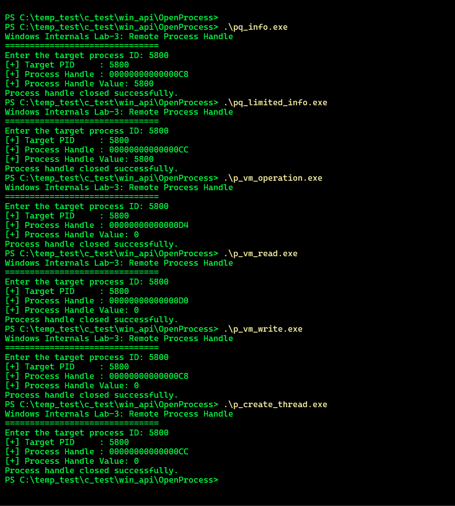
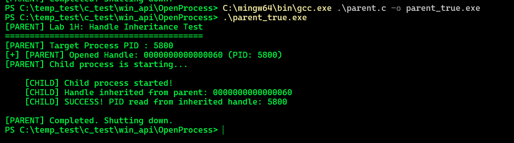
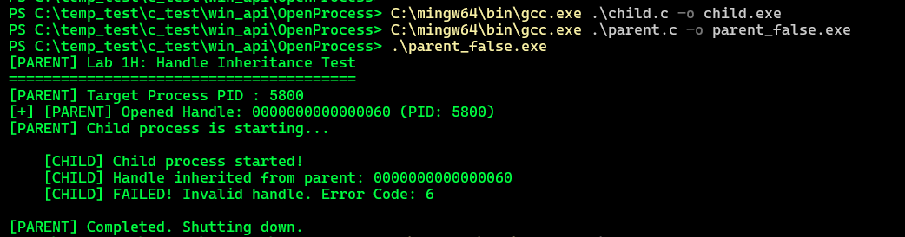
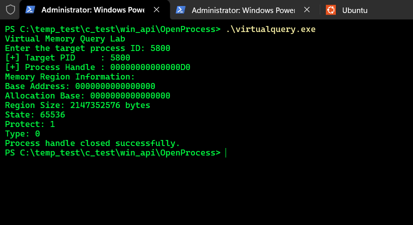
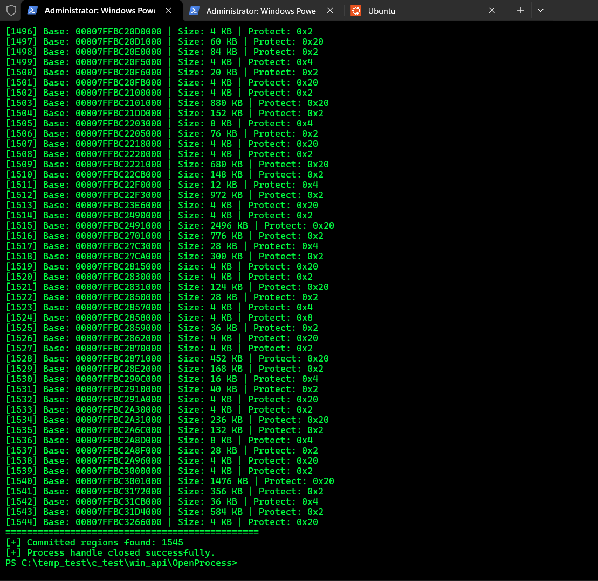

# Windows Process Internals Lab

> Hands-on Windows internals study focused on process handles, access
> masks, virtual memory inspection, handle inheritance, and the Win32 →
> Native API → syscall path.
>
> **Purpose:** understand Windows process manipulation from a defensive
> / detection-engineering perspective by observing API behavior directly
> in C and x64dbg.

------------------------------------------------------------------------

## 1. Objective

The goal of this lab series was not to build an injection framework or
exploit anything.

The goal was to answer a simpler but more important question:

> **"When Windows code interacts with another process, what actually
> happens underneath the Win32 API?"**

The study followed this model:

``` text
Win32 API
    ↓
kernel32 / kernelbase
    ↓
ntdll Native API
    ↓
syscall
    ↓
Windows kernel
    ↓
Process / Handle / Memory objects
```

Each concept was tested with a small C program and, where useful,
inspected with x64dbg.

------------------------------------------------------------------------

# 2. Lab 1 --- Access Masks

## What was tested

This lab focused on Windows process access rights and how individual
rights can be combined into access masks.

## C File

[Access Masks](../OpenProcess/test4.c)

Example output:

``` text
PROCESS_QUERY_INFORMATION:       0x0400
PROCESS_VM_READ:                 0x0010
PROCESS_VM_WRITE:                0x0020
PROCESS_VM_OPERATION:            0x0008
PROCESS_CREATE_THREAD:           0x0002
PROCESS_QUERY_LIMITED_INFORMATION: 0x1000

PROCESS_VM_READ | PROCESS_VM_WRITE:
0x0030

PROCESS_VM_READ | PROCESS_VM_WRITE | PROCESS_VM_OPERATION:
0x0038
```


## What was learned

Windows process access is represented as a **bit mask**.

Individual rights can be combined with bitwise OR:

``` c
PROCESS_VM_READ |
PROCESS_VM_WRITE |
PROCESS_VM_OPERATION
```

producing:

``` text
0x0038
```

This matters because APIs such as `OpenProcess()` do not simply say:

> "Give me the process."

They request a specific set of **permissions on the resulting handle**.

For example:

``` text
PROCESS_VM_READ
```

is different from:

``` text
PROCESS_VM_READ |
PROCESS_VM_WRITE |
PROCESS_VM_OPERATION
```

This becomes particularly important when interpreting telemetry such as
Sysmon Event ID 10 and its `GrantedAccess` field.

------------------------------------------------------------------------

# 3. Lab 2 --- OpenProcess and the Process Handle

## Test

A small C program was written around:

```c
HANDLE hProcess = OpenProcess(
    PROCESS_QUERY_LIMITED_INFORMATION,
    FALSE,
    targetPid
);
```

The program asks for a target process ID and attempts to open that
process with PROCESS_QUERY_LIMITED_INFORMATION.

If successful, it prints:

```c
Target PID
Process Handle
Process ID resolved from Handle
```

The handle is then closed with:
```
CloseHandle(hProcess);
```

## C File
[OpenProcess](./test3.c)

Example Output:

```
Windows Internals Lab-3: Remote Process Handle
===============================
Enter the target process ID: 5800
[+] Target PID     : 5800
[+] Process Handle : 00000000000000CC
[+] Process Handle Value: 5800
[+] bInheritHandle      : FALSE
Process handle closed successfully.
```

## Important observation

The returned value was something similar to:

```
00000000000000CC
```

This is a HANDLE value.

It is not the target PID and it is not the address of the process object
in kernel memory.

The target PID in this test was:

```
5800
```

while the returned handle was:

```
00000000000000CC
```

These are two completely different values.

Conceptually:

```
Our process
    |
    | HANDLE value
    v
Handle table
    |
    v
Process object
```

The handle provides the calling process with access to the
kernel-managed process object according to the access rights requested
when the handle was created.

## What was learned

OpenProcess() does not return a PID.

It returns a HANDLE representing an entry through which the calling
process can access the target process object.

The basic flow is:

```
Target PID
    |
    | OpenProcess()
    v
Process HANDLE
    |
    | GetProcessId()
    v
Target PID
    |
    | CloseHandle()
    v
HANDLE closed
```

This establishes the basic relationship between:

```
PID
HANDLE
Process Object
```

which is fundamental to understanding later process manipulation APIs.

------------------------------------------------------------------------

# 4. Lab 3 --- `bInheritHandle` and Handle Inheritance

## What was tested

The `bInheritHandle` parameter of `OpenProcess()` was investigated
together with the parent/child process handle inheritance mechanism.

The parent process first opens the target process:

```c
HANDLE hProcess = OpenProcess(
    PROCESS_QUERY_LIMITED_INFORMATION,
    FALSE,
    targetPid
);
```
The resulting process handle is then used in a parent/child process
experiment.

## Parent process

The parent creates a child process with CreateProcessA().

The child receives the handle value and attempts to use it with:

```
GetProcessId(hInherited);
```

## Child process

The child converts the received handle value back into a HANDLE and
tests whether the handle is valid.

If successful:

```
[CHILD] BASARILI!
Miras alinan Handle uzerinden okunan PID: 5800
```

If the handle is not valid:

```
[CHILD] BAŞARISIZ!
Handle gecersiz. Hata Kodu: 6
```

## Initial observation

Simply changing the bInheritHandle value of OpenProcess() does not
immediately make the handle appear in another process.

The effect of handle inheritance becomes relevant when a child process
is created.

Conceptually:

```
Parent Process
     |
     | Process Handle
     |
     | CreateProcess()
     v
Child Process
     |
     | inherited handle
     v
Target Process
```

The experiment demonstrated that handle inheritance is a
parent/child process relationship, rather than a property that
causes an existing handle to automatically appear in every process.

## C Files

[Parent](./parent.c)

[Child](./child.c)

------------------------------------------------------------------------

# 5. Lab 4 --- Actual Handle Inheritance

To demonstrate the effect of bInheritHandle, a parent/child process
test was created.

The parent process:

* 1- Opened the target process.
* 2- Requested an inheritable handle.
* 3- Created a child process.
* 4- The child attempted to use the inherited handle.

```
bInheritHandle = TRUE
```

Observed:

```
[PARENT] Allocated Handle: 0000000000000060
[PARENT] Child process triggered...


    [CHILD] Child process started!
    [CHILD] Handle inherited from parent: 0000000000000060
    [CHILD] SUCCESS! PID read through inherited handle: 5800
```




The child successfully used the inherited handle.

```
bInheritHandle = FALSE
```

Observed:

```
[PARENT] Allocated Handle: 0000000000000060
[PARENT] Child process triggered...


    [CHILD] Child process started!
    [CHILD] FAILED! Handle invalid. Error Code: 6
```



6 corresponds to:

```
ERROR_INVALID_HANDLE
```

## Conclusion

The difference between TRUE and FALSE is therefore not:

* "OpenProcess behaves differently."

The important difference is:

 * Whether the resulting handle can participate in handle inheritance
   when a suitable child process is created.


Conceptually:

```
bInheritHandle = TRUE

Parent
  |
  | Handle
  v
Child
  |
  | same inherited handle
  v
Target Process
```

versus:

```
bInheritHandle = FALSE

Parent
  |
  | Handle
  v
Target Process

Child
  |
  X
No inherited handle
```

------------------------------------------------------------------------

# 6. Lab 5 --- VirtualQueryEx and Process Memory

## What was tested

The `VirtualQueryEx()` API was used to inspect the virtual memory
layout of a target process.

The program opened the target process with:

```c
HANDLE hProcess = OpenProcess(
    PROCESS_QUERY_INFORMATION | PROCESS_VM_READ,
    FALSE,
    targetPid
);
```
MEMORY_BASIC_INFORMATION structure was then passed to:

```
VirtualQueryEx()
```

The first query started at:

```
LPCVOID lpaddress = NULL;
```

and returned information about the memory region containing that
address.

## C File

[VirtualQueryEx](./test5.c)

## Observed output

```
Virtual Memory Query Lab
Enter the target process ID: 5800
[+] Target PID     : 5800
[+] Process Handle : 00000000000000D0
Memory Region Information:
Base Address: 0000000000000000
Allocation Base: 0000000000000000
Region Size: 2147352576 bytes
State: 65536
Protect: 1
Type: 0
Process handle closed successfully.
```



## What was learned

VirtualQueryEx() does not read the contents of process memory.

Instead, it retrieves information about a region of virtual memory.

The returned MEMORY_BASIC_INFORMATION structure contains information
such as:

```
BaseAddress
AllocationBase
RegionSize
State
Protect
Type
```

The important distinction is:

```
VirtualQueryEx()
      |
      v
Memory region metadata
```

rather than:

```
VirtualQueryEx()
      |
      v
Actual memory contents
```

This distinction becomes important when moving from memory layout
inspection to APIs such as ReadProcessMemory().

## Important observation

The first query began at address NULL:

```
LPCVOID lpaddress = NULL;
```

Therefore the result describes the virtual memory region containing
that starting address.

A complete memory map requires repeatedly calling VirtualQueryEx()
with the address of the next region:

```
lpaddress =
    (PBYTE)mbi.BaseAddress +
    mbi.RegionSize;
```

That was explored in a later version of the lab, where hundreds of
memory regions were enumerated.

The key concept is:

```
Process Virtual Address Space
        |
        +-- Region
        +-- Region
        +-- Region
        +-- Region
        +-- ...
```

A process's virtual address space is therefore composed of many
individual regions rather than being one continuous memory block.

## 5.2 --- Enumerating Virtual Memory Regions

### What was tested

The previous test queried a single virtual memory region.

In this test, `VirtualQueryEx()` was called repeatedly to enumerate the
target process's virtual address space region by region.

The enumeration started at:

```c
PBYTE lpaddress = NULL;
```
After each successful query, the address was advanced to the beginning
of the next region:

```
lpaddress =
    (PBYTE)mbi.BaseAddress + mbi.RegionSize;
```

Only committed regions were displayed:

```
if (mbi.State == MEM_COMMIT)
```

## C File

[VirtualQueryEx Enumeration](./test6.c)

Output:



## What was learned

VirtualQueryEx() can be used repeatedly to walk through the virtual
address space of another process.

Each successful query describes one memory region through the
MEMORY_BASIC_INFORMATION structure.

The important values used in this lab were:

```
BaseAddress
RegionSize
State
Protect
```


This allows the program to move from one region to the next.

Conceptually:

```
Virtual Address Space

Region 0
    |
    | BaseAddress + RegionSize
    v
Region 1
    |
    | BaseAddress + RegionSize
    v
Region 2
    |
    | BaseAddress + RegionSize
    v
Region 3
    |
    v
...
```

The experiment demonstrated that a process's virtual address space is
composed of many separate memory regions rather than one continuous
memory block.

The experiment demonstrated that a process's virtual address space is
composed of many separate memory regions rather than one continuous
memory block.

------------------------------------------------------------------------

